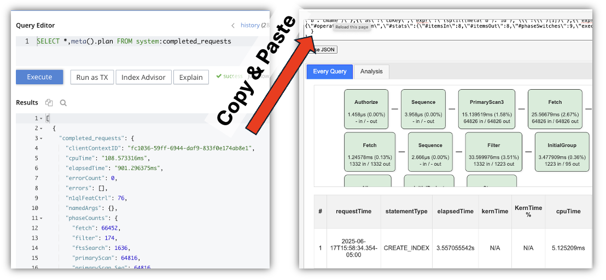

# Couchbase Query Analyzer v4.0.0

A web-based tool for analyzing Couchbase N1QL query performance and execution plans from `system:completed_requests`. Visualize query patterns, identify bottlenecks, and optimize database performance with advanced index usage tracking, execution-plan analysis, and AI-powered insights.

#### (Capella Compatible)

---

## Two Editions

| Edition | Version | Best For | How to Run |
|---|---|---|---|
| **Static** | 3.29.3 | Quick one-off analysis, no install | Open [`en/index.html`](en/index.html) in a browser |
| **Server** | 4.0.0 | Persistent analyses, AI insights, team use | Docker / macOS app / Windows exe |

🚀 **Hosted Static Edition:** https://cb.fuj.io/en/

---

## Server Edition (v4.0.0) — Quick Start

The Server Edition is a Flask backend with Couchbase persistence and AI-powered query analysis (OpenAI / Anthropic Claude / xAI Grok).

### Option A — Docker (recommended)

From the project root:

```bash
docker compose up --build      # build & run (foreground)
docker compose up -d           # detached
docker compose logs -f         # tail logs
docker compose down            # stop
```

Open **http://localhost:8888**.

The compose stack runs `gunicorn` (2 workers × 4 threads) inside the container. Tunables can be overridden in [`docker-compose.yml`](docker-compose.yml) or per-run:

```bash
GUNICORN_WORKERS=4 docker compose up -d
```

Runtime config (Couchbase creds, AI keys) is bind-mounted from `./app/config.json`.

> **Note for macOS/Windows users:** if your Couchbase server runs on the host machine, use `host.docker.internal` instead of `localhost` in the connection URL.

### Option B — Local Python (development)

```bash
cd app
./setup_venv.sh
source venv/bin/activate
pip install -r requirements.txt
python app.py
```

Open **http://localhost:8888**.

See [`app/README_SERVER.md`](app/README_SERVER.md) and [`app/QUICKSTART.md`](app/QUICKSTART.md) for full server-edition docs.

### Option C — Native macOS / Windows binary

Built via GitHub Actions with PyInstaller. Download from the **Releases** page:

- `QueryAnalyzer-4.0.0.dmg` (macOS)
- `QueryAnalyzer-4.0.0-Setup.exe` (Windows)

Both run as a tray/menu-bar app and open the analyzer in your default browser.

### Server Edition AI Provider Support

| Provider | Models |
|---|---|
| OpenAI | GPT-4o, GPT-4o-mini, o3, o4-mini |
| Anthropic Claude | Claude 3.5 Sonnet, Claude 3.5 Haiku, Claude 4 |
| xAI Grok | Grok-3, Grok-4 |
| Custom | Any OpenAI-compatible endpoint |

---

## Static Edition (v3.29.3) — Quick Start

Single-file HTML — no install, no server.

### Step 1: Get the Tool
- Open the hosted version: https://cb.fuj.io/en/
- Or download [`en/index.html`](https://github.com/Fujio-Turner/cb_completed_request/raw/main/en/index.html?download=true) and open it in any modern browser (Firefox tends to render the largest payloads fastest).

### Step 2: Extract Query Data

Run in Couchbase Query Workbench or `cbq`:

```sql
SELECT *, meta().plan FROM system:completed_requests ORDER BY requestId LIMIT 2000;
```

> Returns ~36 MB of JSON for 2 000 rows. Anything bigger may crash the browser — drop the `LIMIT` if you hit performance issues. See [`sql_queries.html`](sql_queries.html) for more query options.

### Step 3: Analyze

Copy the full JSON result and paste it into the tool's input area, then click **Parse JSON**.



### Step 4: (Optional) Filter by Date Range

Date fields auto-populate with the data's full time range. Adjust **From**/**To** and click **Parse JSON** again.

### Step 5: (Optional) Enhanced Index Analysis

Run the index query, paste the result into the second input box, and click **Parse JSON**:

```sql
SELECT
 s.name,
 s.id,
 s.metadata,
 s.state,
 s.num_replica,
 CONCAT("CREATE INDEX ", s.name, " ON ", k, ks, p, w, ";") AS indexString
FROM system:indexes AS s
LET bid = CONCAT("", s.bucket_id, ""),
    sid = CONCAT("", s.scope_id, ""),
    kid = CONCAT("", s.keyspace_id, ""),
    k   = NVL2(bid, CONCAT2(".", bid, sid, kid), kid),
    ks  = CASE WHEN s.is_primary THEN "" ELSE "(" || CONCAT2(",", s.index_key) || ")" END,
    w   = CASE WHEN s.condition IS NOT NULL THEN " WHERE " || REPLACE(s.condition, '"', "'") ELSE "" END,
    p   = CASE WHEN s.`partition` IS NOT NULL THEN " PARTITION BY " || s.`partition` ELSE "" END;
```

---

## Features (Both Editions)

### Eight Analysis Tabs

#### 1. Dashboard
- Query Duration Distribution bar chart
- Primary Indexes Used donut with warning system + "Learn More" link
- Query Pattern Features
- Users by Query Count (sortable)
- Index Usage Count (sortable)
- Statement Type pie (SELECT / INSERT / UPDATE / DELETE)
- Query State pie

#### 2. Insights
- **Index Performance Issues** — inefficient scans, slow index scans, primary index over-usage, ORDER BY/LIMIT/OFFSET over-scan (Beta)
- **Resource Utilization** — high kernel time, high memory usage, slow USE KEYS queries
- **Query Pattern Analysis** — missing WHERE clauses, leading-wildcard LIKE, SELECT *

#### 3. Timeline
Six interactive charts in a 2×3 grid (Duration Buckets, Query Types, Operations, Filter, Timeline, Memory) with Reset Zoom, Linear/Log Y-axis, time-grouping by Optimizer / Minute / Second, and pan/zoom/box-select.

#### 4. Query Groups
Aggregated, normalized analysis (literals → `?`) with total_count, min/max/avg/median duration, avg fetch / primaryScan / indexScan, and per-user breakdowns. Excludes INFER / ADVISE / CREATE / ALTER INDEX / SYSTEM queries.

#### 5. Every Query
17-column sortable table with interactive flow diagrams and color-coded execution plans. Batch processing for large datasets.

#### 6. Index/Query Flow
Visual index ↔ query relationships with enhanced primary-index detection.

#### 7. Indexes
Complete index catalog with advanced filtering, smart consolidation, and query-index matching.

#### 8. Report Maker (Beta)
Pick sections (Dashboard, Timeline, Query Groups, etc.), include filters/header summary, flatten scrollable tables, convert charts to images, then **Preview → Print / Save PDF**.

### Server-Edition–Only Features
- AI-powered query analysis (OpenAI, Claude, Grok, custom)
- Persistent storage of analyses and user preferences in Couchbase
- Multi-user / team-shareable analyzer sessions
- Reusable connection profiles

---

## Understanding the Visualizations

| Bubble Color | Meaning |
|---|---|
| 🟢 Green | < 25 % of total query time |
| 🟡 Yellow | 25 – 50 % |
| 🟠 Orange | 50 – 75 % |
| 🔴 Red | > 75 % |
| **Highlighted** | Query uses a primary scan (optimization candidate) |

### Time Grouping Guidelines

| Grouping | Best Range |
|---|---|
| **By Optimizer** | Auto-selects best (recommended) |
| **By Second** | ≤ 1 hour |
| **By Minute** | ≤ 1 day |
| **By Hour** | ≤ 1 month |
| **By Day** | > 1 month |

⚠️ Large date ranges with fine-grained groupings can cause chart-rendering errors — the tool will warn you.

---

## Project Layout

```
cb_completed_request/
├── app/                  # Server Edition v4.0.0 (Flask + AI)
├── en/                   # Static Edition v3.29.3 (single-file HTML)
├── old_pre_4_0/          # Archived pre-4.0 files (de/es/pt + legacy assets)
├── playwright/           # E2E tests (both editions)
├── tests/                # Python unit tests + Jest specs
├── sample/               # Sample JSON data
├── docker-compose.yml    # Run Server Edition with `docker compose up`
├── Dockerfile            # (Static Edition / nginx — legacy)
└── README.md             # You are here
```

See [`AGENT.md`](AGENT.md) for the full architecture overview and [`BIG_MOVE_4_0_0.md`](BIG_MOVE_4_0_0.md) for the v3 → v4 migration history.

---

## Testing

```bash
# Python unit tests (server edition)
cd app && source venv/bin/activate && pytest ../tests/python/ -v   # 76 tests

# Jest unit tests
npm test                                                            # 40 tests

# Playwright E2E
npm run test:e2e                       # all (both editions, all browsers)
npm run test:e2e:static:chromium       # static edition, fast
npm run test:e2e:server:chromium       # server edition, fast
```

---

## Troubleshooting

| Symptom | Fix |
|---|---|
| Empty results from `system:completed_requests` | Enable query logging in Couchbase |
| Browser slow / crashes on large JSON | Reduce `LIMIT` (try 500), or use the Server Edition |
| Chart rendering error | Use a coarser time grouping (e.g. **By Hour** instead of **By Minute**) |
| "Too far apart" error | Time range is too wide for the chosen grouping — see table above |
| Docker: connection refused to host Couchbase | Use `host.docker.internal` (Mac/Windows) instead of `localhost` |
| Docker logs show `toon-python` install error | Suppressed by `SKIP_TOON_INSTALL=1` in compose; harmless if you see it |

---

## Release Notes

See [`release_notes.md`](release_notes.md).

## Requirements

- Modern web browser with JavaScript enabled
- Couchbase Server (any recent version) with query logging enabled
- Read access to `system:completed_requests` (admin privileges)
- For Server Edition: Docker, **or** Python 3.11+, **or** macOS/Windows native installer
