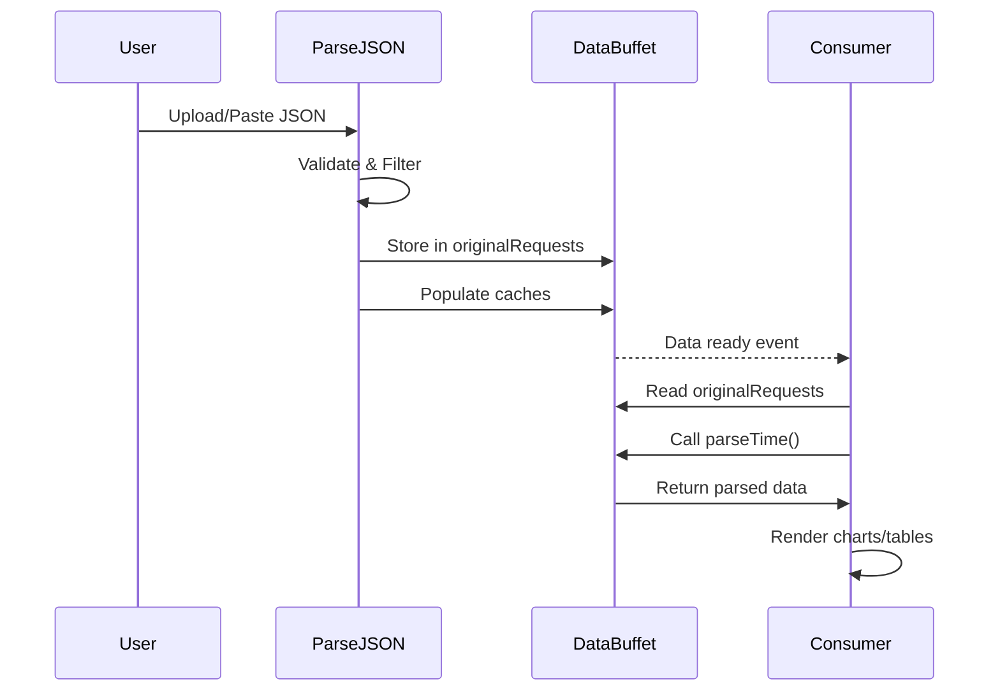

# Data Buffet API Guide - Consumer Documentation

## Introduction

Welcome to the **Data Buffet** - the centralized data layer for the Couchbase Query Analyzer. This guide explains how to consume data, what's available, and how to use the caching system.

## Quick Start

```javascript
// Import the data layer
import { 
    originalRequests,
    statementStore, 
    allIndexes,
    parseTime,
    getNormalizedStatement 
} from './data-layer.js';

// Use the data
console.log(`Total requests: ${originalRequests.length}`);

// Create a chart
const durations = originalRequests.map(r => r.elapsedTime);
createChart('my-chart', durations);
```

## Global Data Objects

### 📊 `originalRequests` (Array)

**Primary data source** - Filtered array of completed request objects.

**Structure:**
```javascript
[
    {
        requestId: "abc123...",
        requestTime: "2025-11-06 14:23:45.123Z",
        elapsedTime: "1.234s",
        statement: "SELECT * FROM bucket WHERE ...",
        state: "completed",
        plan: { /* execution plan object */ },
        clientContextID: "...",
        // ... other fields
    },
    // ... more requests
]
```

**Common Usage:**
```javascript
// Get all completed queries
const completed = originalRequests.filter(r => r.state === 'completed');

// Get queries by duration
const slow = originalRequests.filter(r => parseFloat(r.elapsedTime) > 5.0);

// Group by collection
const byCollection = {};
originalRequests.forEach(req => {
    const normalized = getNormalizedStatement(req.statement);
    // ... group logic
});
```

### 📝 `statementStore` (Object)

**SQL statement lookup** by request ID (avoids HTML escaping issues).

**Structure:**
```javascript
{
    "requestId1": "SELECT * FROM bucket WHERE id = 123",
    "requestId2": "UPDATE bucket SET status = 'active' WHERE ...",
    // ... key: requestId, value: SQL statement
}
```

**Common Usage:**
```javascript
// Get statement by request ID
const statement = statementStore[requestId];

// Display in modal
document.getElementById('query-modal-text').textContent = statementStore[requestId];
```

### 🔍 `analysisStatementStore` (Object)

**Normalized statement lookup** for analysis/aggregation.

**Structure:**
```javascript
{
    "requestId1": "SELECT * FROM bucket WHERE id = ?",
    "requestId2": "UPDATE bucket SET status = ? WHERE ...",
    // ... normalized with placeholders
}
```

**Common Usage:**
```javascript
// Group queries by pattern
const groups = {};
Object.entries(analysisStatementStore).forEach(([reqId, normalized]) => {
    if (!groups[normalized]) groups[normalized] = [];
    groups[normalized].push(reqId);
});
```

### 📑 `allIndexes` (Array)

**Index definitions** from `system:indexes`.

**Structure:**
```javascript
[
    {
        name: "idx_user_email",
        keyspace_id: "bucket_name",
        index_key: ["email"],
        state: "online",
        using: "gsi",
        is_primary: false,
        // ... other fields
    },
    // ... more indexes
]
```

**Common Usage:**
```javascript
// Find index by name
const idx = allIndexes.find(i => i.name === 'idx_user_email');

// Get all primary indexes
const primary = allIndexes.filter(i => i.is_primary);

// Group by bucket
const byBucket = allIndexes.reduce((acc, idx) => {
    const bucket = idx.keyspace_id;
    if (!acc[bucket]) acc[bucket] = [];
    acc[bucket].push(idx);
    return acc;
}, {});
```

## Cache Objects

### ⏱️ `parseTimeCache` (Map)

**Caches parsed time strings** to Date objects.

**Limit:** 50,000 entries (LRU eviction)

**Usage:**
```javascript
// Direct cache access (not recommended - use parseTime function)
const cached = parseTimeCache.get(timeString);

// Recommended: Use helper function
const date = parseTime("1.234s"); // Returns milliseconds
```

### 🔤 `normalizeStatementCache` (Map)

**Caches normalized SQL statements** (literals replaced with `?`).

**Limit:** 20,000 entries (LRU eviction)

**Usage:**
```javascript
// Recommended: Use helper function
const normalized = getNormalizedStatement("SELECT * FROM bucket WHERE id = 123");
// Returns: "SELECT * FROM bucket WHERE id = ?"
```

### 🗂️ `operatorsCache` (WeakMap)

**Caches extracted operators** from execution plans.

**Auto-cleaned:** By JavaScript garbage collector

**Usage:**
```javascript
// Typically accessed internally by helper functions
const operators = getOperators(request.plan);
```

### 📈 `planStatsCache` (WeakMap)

**Caches plan statistics** (operator counts, types).

**Auto-cleaned:** By JavaScript garbage collector

### ⏲️ `timeUnitCache` (WeakMap)

**Caches time unit conversions** (s, ms, µs, ns).

**Auto-cleaned:** By JavaScript garbage collector

### 🕐 `timestampRoundingCache` (Map)

**Caches rounded timestamps** for time bucketing.

**Limit:** 10,000 entries

## Helper Functions

### `parseTime(timeString)`

**Converts time string to milliseconds.**

```javascript
parseTime("1.234s")     // → 1234 (ms)
parseTime("567ms")      // → 567 (ms)
parseTime("89.5µs")     // → 0.0895 (ms)
parseTime("123ns")      // → 0.000123 (ms)
```

**Returns:** `number` (milliseconds) or `0` if invalid

### `getNormalizedStatement(sql)`

**Normalizes SQL by replacing literals with `?`.**

```javascript
getNormalizedStatement("SELECT * FROM bucket WHERE id = 123")
// → "SELECT * FROM bucket WHERE id = ?"

getNormalizedStatement("UPDATE bucket SET status = 'active'")
// → "UPDATE bucket SET status = ?"
```

**Returns:** `string` (normalized SQL)

### `getOperators(plan)`

**Extracts operator tree from execution plan.**

```javascript
const operators = getOperators(request.plan);
// Returns array of operator objects:
// [ { operator: "Scan", details: {...} }, ... ]
```

**Returns:** `array` of operator objects

### `clearCaches()`

**Clears all caches** (call before re-parsing JSON).

```javascript
clearCaches(); // Clears parseTimeCache, normalizeStatementCache, etc.
```

### `detectTimezoneFromData(data)`

**Auto-detects timezone** from request timestamps.

```javascript
const timezone = detectTimezoneFromData(processData);
// Returns: "America/New_York", "UTC", etc.
```

## Data Filtering

Filters are applied during `parseJSON()`:

### Date Range Filter
```javascript
// Set in UI, applied automatically
startDate: "2025-01-01"
endDate: "2025-12-31"
```

### Collection Filter
```javascript
// Filter by bucket/collection
collectionFilter: "bucket_name"
```

### Query Type Filter
```javascript
// Filter by statement type
queryType: "SELECT" | "UPDATE" | "INSERT" | "DELETE" | "all"
```

### System Query Filter
```javascript
// Exclude system queries (auto-applied)
excludeSystemQueries: true
```

## Best Practices

### ✅ DO

1. **Use helper functions** instead of direct cache access
2. **Check data availability** before consuming
3. **Filter/map** instead of mutating originalRequests
4. **Use parseTime** for all time conversions
5. **Cache chart instances** to prevent memory leaks

```javascript
// Good
if (originalRequests.length > 0) {
    const durations = originalRequests.map(r => parseTime(r.elapsedTime));
    createChart(durations);
}
```

### ❌ DON'T

1. **Don't mutate** `originalRequests` directly
2. **Don't access** caches without checking existence
3. **Don't parse time** manually (use `parseTime()`)
4. **Don't create** duplicate caches
5. **Don't forget** to destroy Chart.js instances

```javascript
// Bad
originalRequests[0].elapsedTime = "5s"; // Mutation!
const ms = parseFloat(timeStr.replace('s', '')) * 1000; // Manual parsing!
```

## Data Lifecycle



## Example: Creating a Chart Consumer

```javascript
import { originalRequests, parseTime } from './data-layer.js';

function createDurationChart() {
    // Check data availability
    if (originalRequests.length === 0) {
        console.warn('No data available');
        return;
    }

    // Extract and transform data
    const labels = originalRequests.map(r => r.requestTime);
    const durations = originalRequests.map(r => parseTime(r.elapsedTime));

    // Create chart
    const ctx = document.getElementById('duration-chart').getContext('2d');
    const chart = new Chart(ctx, {
        type: 'line',
        data: {
            labels: labels,
            datasets: [{
                label: 'Query Duration (ms)',
                data: durations,
                borderColor: 'rgb(75, 192, 192)',
            }]
        },
        options: {
            responsive: true,
            scales: {
                y: { beginAtZero: true }
            }
        }
    });

    // Store chart instance for cleanup
    window.myChartInstances = window.myChartInstances || [];
    window.myChartInstances.push(chart);
}

// Listen for data ready event
document.addEventListener('dataReady', createDurationChart);
```

## Troubleshooting

### No data in `originalRequests`
- Check if `parseJSON()` was called
- Verify JSON input is valid
- Check filter settings (date range, collection)

### Cache misses
- Caches are cleared on new parse
- WeakMap caches are auto-cleaned by GC
- Map caches evict oldest entries when limit reached

### Performance issues
- Use caches (don't parse repeatedly)
- Limit data size with filters
- Destroy Chart.js instances when done
- Use lazy loading for heavy UI

---

**Version:** 1.0  
**Last Updated:** 2025-11-06  
**Author:** Fujio Turner  
**Related:** [Data Layer Architecture](./data-layer-architecture.md)
