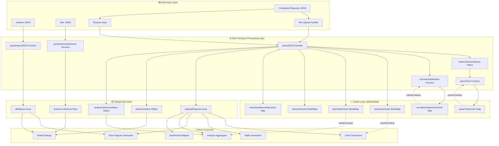

# Data Layer Architecture - Liquid Snake Edition

## Overview

This document describes the data layer architecture for the Couchbase Query Analyzer (Liquid Snake refactor). The architecture separates data parsing/caching from data consumption, creating a clean "data buffet" that consumers can use.

## Architecture Diagram



## Data Flow Process

### 1. **Input Stage**
- User uploads JSON files or pastes into textarea
- Three data sources:
  - `system:completed_requests` → Main query data
  - `system:indexes` → Index definitions
  - Schema inference → Bucket/collection structure

### 2. **Parsing Stage**
- `parseJSON()` - Main entry point, parses completed requests
- `parseIndexJSON()` - Parses index definitions
- `parseSchemaInference()` - Parses schema/bucket data
- Filters applied: date range, collection, query type, system queries

### 3. **Caching Stage**
- Parsed data stored in Maps and WeakMaps for performance
- Caches prevent redundant parsing (e.g., timestamps, SQL normalization)
- Auto-eviction on size limits (LRU-style for Maps)
- WeakMap caches auto-cleaned by garbage collector

### 4. **Data Store Stage**
- Filtered/processed data stored in global variables:
  - `originalRequests` - Main dataset for all consumers
  - `statementStore` - SQL statements by request ID
  - `allIndexes` - Index metadata
  
### 5. **Consumption Stage**
- Consumers read from global data store
- Charts, tables, diagrams generated on-demand
- Cache lookups for expensive operations (time parsing, normalization)

## Separation Strategy

### **Data Layer (Buffet)** 
Located in: `/liquid_snake/assets/js/data-layer.js`

**Responsibilities:**
- Parse JSON inputs
- Apply filters (date, collection, query type)
- Populate caches
- Expose global data stores
- Provide helper functions (parseTime, normalizeStatement, etc.)

**Exports:**
- `originalRequests` - Filtered request data
- `statementStore` - SQL statement lookup
- `allIndexes` - Index definitions
- Cache objects (for lookup)
- Parser functions

### **Consumer Layer**
Located in separate files:

- `/liquid_snake/assets/js/charts.js` - Chart generation
- `/liquid_snake/assets/js/tables.js` - Table rendering  
- `/liquid_snake/assets/js/flow-diagram.js` - Flow visualization
- `/liquid_snake/assets/js/analysis.js` - Data aggregation
- `/liquid_snake/assets/js/modals.js` - Modal dialogs
- `/liquid_snake/assets/js/ui-helpers.js` - DOM manipulation

**Imports:**
```javascript
import { 
    originalRequests, 
    statementStore, 
    allIndexes,
    parseTimeCache,
    getOperators,
    getNormalizedStatement 
} from './data-layer.js';
```

## Benefits

1. **Separation of Concerns** - Data handling vs UI rendering
2. **Testability** - Data layer can be unit tested independently
3. **Reusability** - Multiple consumers use same data source
4. **Performance** - Centralized caching strategy
5. **Maintainability** - Clear boundaries between layers
6. **Modularity** - Easy to add new consumers (plugins, widgets)

## Migration Path

1. ✅ Extract CSS to `main.css`
2. ✅ Extract JS to `main.js`
3. 🔄 Split `main.js` into data layer + consumers
4. ⏳ Add ES6 module support to HTML
5. ⏳ Update imports/exports
6. ⏳ Test each consumer independently

---

**Version:** 1.0  
**Last Updated:** 2025-11-06  
**Author:** Fujio Turner
