# Post-Release Development Version Guide

This guide helps you set up a development version marker after a release is completed. It adds a `-post` suffix to the version and inserts a visible "Dev Build" banner to distinguish development builds from production releases.

## 🎯 When to Use This Guide

**Use POST_RELEASE_GUIDE.md when:**
- You've just completed a release and merged to main
- You're starting development on a new feature branch
- You want to clearly mark the build as a development/post-release version
- You need to prevent confusion between production and development builds

**Do NOT use this guide:**
- On the main branch (script will block you)
- Before completing a release
- On production deployment branches

## ⚠️ Prerequisites

Before running this guide:
1. ✅ Complete release has been merged to main
2. ✅ You are on a non-main branch (feature branch, release branch, etc.)
3. ✅ You know the current production version (e.g., 3.21.0)

## 🔄 Post-Release Version Process

### **Step 1: Verify Branch**

The script will automatically check that you're NOT on the main branch:

```bash
# Check current branch
CURRENT_BRANCH=$(git branch --show-current)

if [ "$CURRENT_BRANCH" = "main" ]; then
    echo "❌ ERROR: You are on the main branch!"
    echo "This script should only be run on development/feature branches."
    echo "Please switch to your feature branch first."
    exit 1
fi

echo "✅ Current branch: $CURRENT_BRANCH"
```

**If on main branch, you'll see:**
```
❌ ERROR: You are on the main branch!
This script should only be run on development/feature branches.
Please switch to your feature branch first.
```

### **Step 2: Determine Post-Release Version**

The post-release version follows this pattern:
```
Production Version: 3.21.0
Post-Release Version: 3.21.0-post
```

Detect the current version and add `-post` suffix:

```bash
# Detect current version from AGENT.md
CURRENT_VERSION=$(grep "Current Version" AGENT.md | grep -o "[0-9]\+\.[0-9]\+\.[0-9]\+")
POST_VERSION="${CURRENT_VERSION}-post"

echo "Current production version: $CURRENT_VERSION"
echo "New post-release version: $POST_VERSION"
```

### **Step 3: Update Version Numbers**

Update all version references to include `-post` suffix:

```bash
# Update AGENT.md
sed -i '' "s/v${CURRENT_VERSION}/v${POST_VERSION}/g" AGENT.md
sed -i '' "s/${CURRENT_VERSION}/${POST_VERSION}/g" AGENT.md

# Update index.html
sed -i '' "s/content=\"${CURRENT_VERSION}\"/content=\"${POST_VERSION}\"/g" index.html
sed -i '' "s/v${CURRENT_VERSION}/v${POST_VERSION}/g" index.html

# Update en/index.html
sed -i '' "s/Version: ${CURRENT_VERSION}/Version: ${POST_VERSION}/g" en/index.html
sed -i '' "s/content=\"${CURRENT_VERSION}\"/content=\"${POST_VERSION}\"/g" en/index.html
sed -i '' "s/v${CURRENT_VERSION}/v${POST_VERSION}/g" en/index.html
sed -i '' "s/APP_VERSION = \"${CURRENT_VERSION}\"/APP_VERSION = \"${POST_VERSION}\"/g" en/index.html

# Update Dockerfile
sed -i '' "s/version=\"${CURRENT_VERSION}\"/version=\"${POST_VERSION}\"/g" Dockerfile

# Update README.md
sed -i '' "s/v${CURRENT_VERSION}/v${POST_VERSION}/g" README.md

echo "✅ Version numbers updated to ${POST_VERSION}"
```

### **Step 4: Add Dev Build Banner**

Insert a floating development build banner at the bottom of both HTML files:

**Banner HTML:**
```html
<!-- DEV BUILD BANNER - Remove before release -->
<div id="dev-build-banner" style="position: fixed; bottom: 20px; left: 50%; transform: translateX(-50%); background: #ff0000; color: #ffffff; padding: 15px 30px; border-radius: 8px; font-size: 20px; font-weight: bold; z-index: 99999; box-shadow: 0 4px 12px rgba(0,0,0,0.5); text-align: center; font-family: Arial, sans-serif; letter-spacing: 1px;">
    ⚠️ DEV BUILD: 3.21.0-post ⚠️
</div>
<!-- END DEV BUILD BANNER -->
```

**Insertion Script:**
```bash
# Function to add dev banner before closing </body> tag
add_dev_banner() {
    local file=$1
    local version=$2
    
    # Check if banner already exists
    if grep -q "DEV BUILD BANNER" "$file"; then
        echo "⚠️  Dev banner already exists in $file, skipping..."
        return
    fi
    
    # Create banner HTML
    local banner="<!-- DEV BUILD BANNER - Remove before release -->
<div id=\"dev-build-banner\" style=\"position: fixed; bottom: 20px; left: 50%; transform: translateX(-50%); background: #ff0000; color: #ffffff; padding: 15px 30px; border-radius: 8px; font-size: 20px; font-weight: bold; z-index: 99999; box-shadow: 0 4px 12px rgba(0,0,0,0.5); text-align: center; font-family: Arial, sans-serif; letter-spacing: 1px;\">
    ⚠️ DEV BUILD: ${version} ⚠️
</div>
<!-- END DEV BUILD BANNER -->"
    
    # Insert before </body> tag
    sed -i '' "s|</body>|${banner}\n</body>|" "$file"
    echo "✅ Added dev banner to $file"
}

# Add banner to both HTML files
add_dev_banner "index.html" "$POST_VERSION"
add_dev_banner "en/index.html" "$POST_VERSION"
```

### **Step 5: Verification**

Verify the changes were applied correctly:

```bash
echo ""
echo "🔍 Verifying post-release setup..."
echo ""

# Check version updates
echo "📦 Version in AGENT.md:"
grep "Current Version" AGENT.md

echo ""
echo "📦 Version in index.html:"
grep "name=\"version\"" index.html

echo ""
echo "📦 Version in en/index.html:"
grep "APP_VERSION" en/index.html | head -1

echo ""
echo "🎨 Dev Banner in index.html:"
grep -A 1 "DEV BUILD BANNER" index.html | head -2

echo ""
echo "🎨 Dev Banner in en/index.html:"
grep -A 1 "DEV BUILD BANNER" en/index.html | head -2

echo ""
echo "✅ Post-release setup complete!"
echo "📍 Version: $POST_VERSION"
echo "🌿 Branch: $CURRENT_BRANCH"
```

## 🔧 Complete Automation Script

Save this as `python/post_release_setup.py` or run manually:

```bash
#!/bin/bash
# Post-Release Development Version Setup
# Usage: bash scripts/post_release_setup.sh

set -e

echo "🚀 Post-Release Development Version Setup"
echo "=========================================="
echo ""

# Step 1: Check branch
CURRENT_BRANCH=$(git branch --show-current)

if [ "$CURRENT_BRANCH" = "main" ]; then
    echo "❌ ERROR: You are on the main branch!"
    echo "This script should only be run on development/feature branches."
    echo "Please switch to your feature branch first:"
    echo "  git checkout -b feature/your-feature-name"
    exit 1
fi

echo "✅ Current branch: $CURRENT_BRANCH"
echo ""

# Step 2: Detect version
CURRENT_VERSION=$(grep "Current Version" AGENT.md | grep -o "[0-9]\+\.[0-9]\+\.[0-9]\+")
POST_VERSION="${CURRENT_VERSION}-post"

echo "📦 Current production version: $CURRENT_VERSION"
echo "📦 New post-release version: $POST_VERSION"
echo ""

# Confirm with user
read -p "Continue with version $POST_VERSION? (y/n) " -n 1 -r
echo ""
if [[ ! $REPLY =~ ^[Yy]$ ]]; then
    echo "Aborted."
    exit 1
fi

# Step 3: Update versions
echo "🔄 Updating version numbers..."

sed -i '' "s/v${CURRENT_VERSION}/v${POST_VERSION}/g" AGENT.md
sed -i '' "s/${CURRENT_VERSION}/${POST_VERSION}/g" AGENT.md
sed -i '' "s/content=\"${CURRENT_VERSION}\"/content=\"${POST_VERSION}\"/g" index.html
sed -i '' "s/v${CURRENT_VERSION}/v${POST_VERSION}/g" index.html
sed -i '' "s/Version: ${CURRENT_VERSION}/Version: ${POST_VERSION}/g" en/index.html
sed -i '' "s/content=\"${CURRENT_VERSION}\"/content=\"${POST_VERSION}\"/g" en/index.html
sed -i '' "s/v${CURRENT_VERSION}/v${POST_VERSION}/g" en/index.html
sed -i '' "s/APP_VERSION = \"${CURRENT_VERSION}\"/APP_VERSION = \"${POST_VERSION}\"/g" en/index.html
sed -i '' "s/version=\"${CURRENT_VERSION}\"/version=\"${POST_VERSION}\"/g" Dockerfile
sed -i '' "s/v${CURRENT_VERSION}/v${POST_VERSION}/g" README.md

echo "✅ Version numbers updated"
echo ""

# Step 4: Add dev banner
echo "🎨 Adding development build banner..."

add_banner() {
    local file=$1
    if grep -q "DEV BUILD BANNER" "$file"; then
        echo "⚠️  Banner already exists in $file"
        return
    fi
    
    local banner="<!-- DEV BUILD BANNER - Remove before release -->
<div id=\"dev-build-banner\" style=\"position: fixed; bottom: 20px; left: 50%; transform: translateX(-50%); background: #ff0000; color: #ffffff; padding: 15px 30px; border-radius: 8px; font-size: 20px; font-weight: bold; z-index: 99999; box-shadow: 0 4px 12px rgba(0,0,0,0.5); text-align: center; font-family: Arial, sans-serif; letter-spacing: 1px;\">
    ⚠️ DEV BUILD: ${POST_VERSION} ⚠️
</div>
<!-- END DEV BUILD BANNER -->"
    
    sed -i '' "s|</body>|${banner}\n</body>|" "$file"
    echo "✅ Added banner to $file"
}

add_banner "index.html"
add_banner "en/index.html"

echo ""
echo "=========================================="
echo "✅ Post-release setup complete!"
echo "📍 Version: $POST_VERSION"
echo "🌿 Branch: $CURRENT_BRANCH"
echo ""
echo "Next steps:"
echo "1. Test the application locally"
echo "2. Verify the red dev banner appears"
echo "3. Commit changes: git commit -am 'chore: set post-release version $POST_VERSION'"
echo "=========================================="
```

## 🔗 Integration with Release Process

### **RELEASE_GUIDE.md Updates**

Add to settings/RELEASE_GUIDE.md in the preparation section:

```markdown
### **Step 0: Remove Dev Build Banner (If Present)**

If you're releasing from a post-release development branch, first remove the dev banner:

```bash
# Check if dev banner exists
if grep -q "DEV BUILD BANNER" index.html; then
    echo "⚠️  Found dev build banner - removing..."
    
    # Remove banner from index.html
    sed -i '' '/<!-- DEV BUILD BANNER/,/<!-- END DEV BUILD BANNER -->/d' index.html
    
    # Remove banner from en/index.html
    sed -i '' '/<!-- DEV BUILD BANNER/,/<!-- END DEV BUILD BANNER -->/d' en/index.html
    
    echo "✅ Dev banner removed"
else
    echo "✅ No dev banner found"
fi
```

**CRITICAL:** Release cannot proceed with dev banner present!
```

### **RELEASE_WORK_CHECK.py Updates**

Add this check to `python/RELEASE_WORK_CHECK.py`:

```python
def check_dev_banner():
    """Check that dev build banner has been removed"""
    print("🔍 Checking for development build banner...")
    issues = []
    
    # Check index.html
    output, _ = run_command('grep -n "DEV BUILD BANNER" index.html', quiet=True)
    if output:
        issues.append("Dev build banner still present in index.html (must be removed for release)")
    
    # Check en/index.html
    output, _ = run_command('grep -n "DEV BUILD BANNER" en/index.html', quiet=True)
    if output:
        issues.append("Dev build banner still present in en/index.html (must be removed for release)")
    
    # Check for -post version suffix
    output, _ = run_command('grep -E "version.*-post" index.html en/index.html AGENT.md', quiet=True)
    if output:
        issues.append("Found '-post' version suffix (must be removed for production release)")
    
    return issues
```

And add to the main() function checks:

```python
# Check 6: Dev banner removed
issues = check_dev_banner()
all_issues.extend(issues)
```

## 📋 Quick Reference Commands

### **Setup Post-Release Version**
```bash
# Run automated script
bash scripts/post_release_setup.sh

# Or manually step by step following this guide
```

### **Check Current Setup**
```bash
# Check if dev banner exists
grep "DEV BUILD BANNER" index.html en/index.html

# Check current version
grep "Current Version" AGENT.md
```

### **Remove Dev Banner for Release**
```bash
# Remove from both HTML files
sed -i '' '/<!-- DEV BUILD BANNER/,/<!-- END DEV BUILD BANNER -->/d' index.html
sed -i '' '/<!-- DEV BUILD BANNER/,/<!-- END DEV BUILD BANNER -->/d' en/index.html

# Remove -post suffix (part of VERSION_UPDATE_GUIDE.md)
```

## 🚨 Common Issues

### Issue: Script says I'm on main but I'm not
```bash
# Verify your branch
git branch --show-current

# If it shows main, create/switch to feature branch
git checkout -b feature/my-feature
```

### Issue: Banner not visible in browser
```bash
# Check if banner HTML is present
grep -A 5 "DEV BUILD BANNER" index.html

# Clear browser cache and hard reload
# Chrome: Cmd+Shift+R (Mac) or Ctrl+Shift+R (Windows/Linux)
```

### Issue: Version still shows production number
```bash
# Re-run version update
CURRENT_VERSION="3.21.0"
POST_VERSION="3.21.0-post"

sed -i '' "s/${CURRENT_VERSION}/${POST_VERSION}/g" AGENT.md index.html en/index.html Dockerfile README.md
```

### Issue: Forgot to remove banner before release
```bash
# Emergency cleanup
sed -i '' '/<!-- DEV BUILD BANNER/,/<!-- END DEV BUILD BANNER -->/d' index.html en/index.html

# Verify removal
grep "DEV BUILD BANNER" index.html en/index.html
# Should return nothing
```

## 📊 Workflow Summary

```mermaid
graph TD
    A[Release Merged to Main] --> B[Create Feature Branch]
    B --> C[Run POST_RELEASE_GUIDE.md]
    C --> D{On Main?}
    D -->|Yes| E[❌ Stop - Switch Branch]
    D -->|No| F[✅ Continue]
    F --> G[Update Versions to X.X.X-post]
    G --> H[Add Red Dev Banner]
    H --> I[Verify & Commit]
    I --> J[Development Work]
    J --> K[Ready for Release?]
    K -->|Yes| L[Remove Banner & -post]
    L --> M[Run RELEASE_GUIDE.md]
    K -->|No| J
```



## 🎯 Success Criteria

Post-release setup is successful when:

1. ✅ Version shows `-post` suffix everywhere (AGENT.md, HTML files, Dockerfile)
2. ✅ Red "DEV BUILD" banner visible at bottom of both index.html and en/index.html
3. ✅ You are on a non-main branch
4. ✅ Changes committed to your feature branch
5. ✅ Banner is highly visible when opening the app in browser

---

**Remember:** The dev banner and `-post` suffix MUST be removed before running RELEASE_GUIDE.md. The RELEASE_WORK_CHECK.py script will fail if they are still present.
