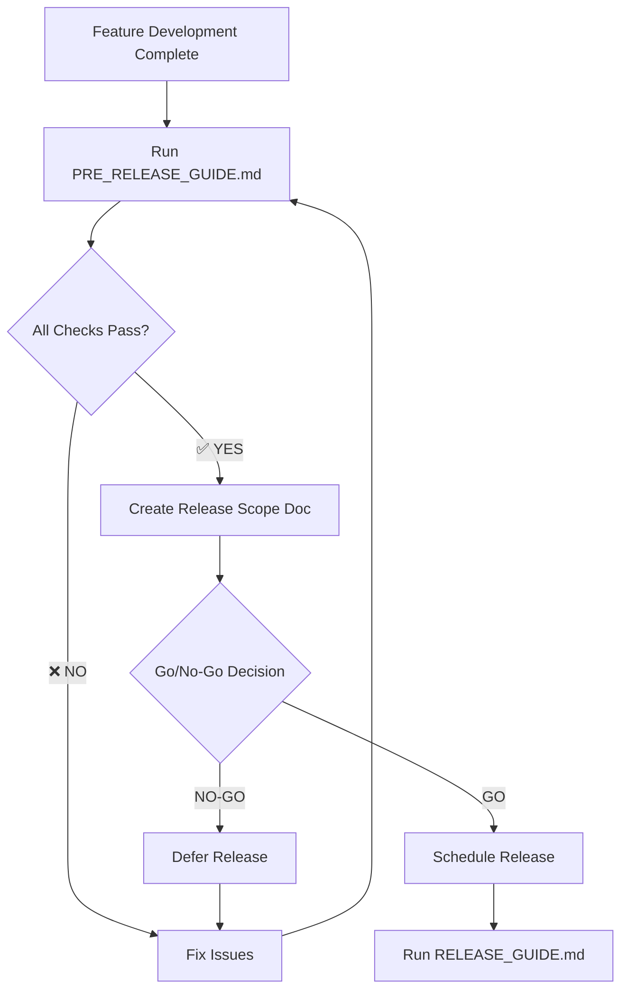

# Pre-Release Preparation Checklist

This guide helps ensure your codebase is release-ready **before** initiating the release process. Use this as a pre-flight checklist to catch issues early and streamline the actual release.

## 🎯 When to Use This Guide

**Use PRE_RELEASE_GUIDE.md when:**
- You're planning a release in the next 1-3 days
- You want to validate release readiness before starting the release workflow
- You need to identify blockers or technical debt before committing to a release
- You want to prepare a release scope and issue list for stakeholders

**Do NOT use this guide:**
- During active release process (use RELEASE_GUIDE.md instead)
- For emergency hotfixes (skip to RELEASE_GUIDE.md)
- For post-release setup (use POST_RELEASE_GUIDE.md)

## ⚠️ Prerequisites

Before starting pre-release checks:
1. ✅ All planned features/fixes for this release are complete
2. ✅ All development branches have been merged
3. ✅ You have time for a full test cycle (1-2 hours minimum)
4. ✅ You know what type of release this will be (MAJOR, MINOR, or PATCH)

## 🔍 Pre-Release Validation Checklist

### **Phase 1: Code Quality & Testing**

#### **1.1 Run Full E2E Test Suite**
🚨 **CRITICAL:** Tests must pass BEFORE any release preparation work.

```bash
# Run complete Playwright test suite
npm run test:e2e

# If tests fail, document failures
npm run test:e2e:report
```

**✅ Success Criteria:**
- [ ] All E2E tests pass
- [ ] No flaky or intermittent failures
- [ ] Test report shows 100% pass rate

**❌ If tests fail:**
1. Create fix branch: `git checkout -b fix/pre-release-e2e-failures`
2. Fix failing tests
3. Re-run tests until all pass
4. Merge fix branch
5. Return to this checklist

See [TESTING_WORKFLOW.md](./TESTING_WORKFLOW.md) for details.

#### **1.2 Validate JavaScript Syntax**
```bash
# Check all HTML files for JavaScript syntax errors
python3 python/validate_js_syntax.py

# Check for common issues
python3 python/find_hardcoded_strings.py
```

**✅ Success Criteria:**
- [ ] No JavaScript syntax errors
- [ ] No hardcoded strings (all use TEXT_CONSTANTS)
- [ ] No console errors when loading files in browser

#### **1.3 Manual Functional Testing**
Open `en/index.html` in browser and verify:

**Dashboard Tab:**
- [ ] JSON loads correctly in both input boxes
- [ ] Parse button processes data without errors
- [ ] Statistics display correctly
- [ ] Export buttons work (Copy Stats, Export CSV)

**Timeline Tab:**
- [ ] Charts render correctly
- [ ] Zoom/pan controls work
- [ ] Time grouping selector works
- [ ] Vertical stake line aligns properly (Issue #148)

**Analysis Tab:**
- [ ] Query aggregation works
- [ ] Sorting and filtering function correctly
- [ ] Modal dialogs open with correct data

**Every Query Tab:**
- [ ] All queries display
- [ ] Search/filter works
- [ ] Individual query details accessible

**Index/Query Flow Tab:**
- [ ] Flow diagrams render
- [ ] Panzoom works correctly
- [ ] Performance highlighting displays

**Indexes Tab:**
- [ ] Index data loads
- [ ] Index management functions work

**✅ Success Criteria:**
- [ ] All tabs load without JavaScript errors
- [ ] All interactive elements respond correctly
- [ ] No visual glitches or layout issues
- [ ] Copy/paste functionality works across all features

### **Phase 2: Version & Documentation Review**

#### **2.1 Check Current Version Status**
```bash
# Verify current version across all files
echo "=== AGENT.md Version ==="
grep "Current Version" AGENT.md

echo "=== index.html Version ==="
grep "name=\"version\"" index.html

echo "=== en/index.html Version ==="
grep "APP_VERSION" en/index.html | head -1

echo "=== en/index.html Header Comment ==="
grep -A 1 "Version:" en/index.html | head -2

echo "=== Dockerfile Version ==="
grep "version=" Dockerfile
```

**✅ Success Criteria:**
- [ ] All files show consistent version number
- [ ] Version format is valid (X.X.X or X.X.X-post)
- [ ] No mismatch between files

**Document your findings:**
- Current Version: `________________`
- Is this a `-post` version? `[ ] Yes [ ] No`

#### **2.2 Check for Dev Build Artifacts**
```bash
# Check for development build banner
grep -n "DEV BUILD BANNER" index.html en/index.html

# Check for -post suffix in versions
grep -E "version.*-post" index.html en/index.html AGENT.md
```

**✅ Success Criteria:**
- [ ] No dev banner present (or note that it needs removal)
- [ ] No `-post` suffix in versions (or note that it needs removal)

**If found, document for release:**
- [ ] Dev banner removal needed before release
- [ ] `-post` suffix removal needed before release

#### **2.3 Review Release Notes**
```bash
# Check release_notes.md exists and is current
cat release_notes.md
```

**✅ Success Criteria:**
- [ ] `release_notes.md` exists
- [ ] Most recent entry matches current development work
- [ ] All recent GitHub issues/PRs are documented
- [ ] Release notes are user-friendly and clear

**If outdated:**
- [ ] Add missing release notes now (don't wait for release day)
- [ ] Reference GitHub issues: https://github.com/Fujio-Turner/cb_completed_request/issues

#### **2.4 Verify Documentation Consistency**
```bash
# Check AGENT.md is current
head -20 AGENT.md

# Check README.md links work
grep -n "release_notes.md" README.md
```

**✅ Success Criteria:**
- [ ] AGENT.md header shows correct current version
- [ ] AGENT.md instructions are current
- [ ] README.md links to release_notes.md
- [ ] All cross-references between docs are valid

### **Phase 3: GitHub & Issue Review**

#### **3.1 Review Open Issues**
Visit: https://github.com/Fujio-Turner/cb_completed_request/issues

**Document open issues:**
```
Blockers for this release:
- [ ] Issue #___ - Description
- [ ] Issue #___ - Description

Issues resolved in this release:
- [ ] Issue #___ - Description
- [ ] Issue #___ - Description

Issues deferred to next release:
- [ ] Issue #___ - Description
```

#### **3.2 Review Recent Commits**
```bash
# Check recent commits since last release
git log --oneline -20

# Check for unreported changes
git log --grep="fix\|feat\|breaking" --oneline --since="1 week ago"
```

**✅ Success Criteria:**
- [ ] All significant commits are documented in release notes
- [ ] No surprise changes or undocumented features
- [ ] Commit history is clean and understandable

#### **3.3 Determine Release Scope**
Use [VERSION_CALCULATION_GUIDE.md](VERSION_CALCULATION_GUIDE.md) to preview:

**Expected Release Type:**
- [ ] MAJOR (Breaking changes)
- [ ] MINOR (New features, enhancements)
- [ ] PATCH (Bug fixes, small improvements)

**Reasoning:**
```
Current version: ___________
Next version: ___________

Justification:
- Changes included: _________________________
- GitHub issues addressed: _________________
- Breaking changes: [ ] Yes [ ] No
```

### **Phase 4: Dependency & Environment Check**

#### **4.1 Verify Dependencies**
```bash
# Check Node.js version
node --version

# Check npm packages are current
npm outdated

# Verify Playwright browsers installed
npx playwright --version
```

**✅ Success Criteria:**
- [ ] Node.js version matches project requirements
- [ ] No critical dependency updates needed
- [ ] Playwright browsers installed and current

#### **4.2 Check Build Environment**
```bash
# Verify Docker setup (if applicable)
docker --version

# Check file permissions
ls -la index.html en/index.html

# Verify git status clean
git status
```

**✅ Success Criteria:**
- [ ] Docker available (if using containerized builds)
- [ ] Files have correct permissions
- [ ] Working directory is clean (or all changes are intentional)

### **Phase 5: Release Planning**

#### **5.1 Create Release Scope Document**
Document your planned release scope:

```markdown
## Release Scope Summary

**Target Version:** X.X.X
**Release Type:** [MAJOR|MINOR|PATCH]
**Planned Release Date:** YYYY-MM-DD
**Release Manager:** [Your Name]

### Features Included
- Feature/improvement #1
- Feature/improvement #2

### Bugs Fixed
- Issue #___ - Description
- Issue #___ - Description

### Known Issues (Not Fixed)
- Issue #___ - Description (deferred to vX.X.X)

### Testing Status
- [ ] E2E tests: PASS
- [ ] Manual testing: PASS
- [ ] Performance testing: [PASS|N/A]

### Documentation Status
- [ ] release_notes.md updated
- [ ] README.md current
- [ ] AGENT.md current

### Blockers
- [ ] None
- [ ] [List any blockers]
```

#### **5.2 Identify Pre-Release Tasks**
Create a task list for issues found during pre-release check:

```markdown
## Pre-Release Tasks (Complete Before RELEASE_GUIDE.md)

### Must Fix Before Release
- [ ] Task 1: _____________________
- [ ] Task 2: _____________________

### Nice to Have (Optional)
- [ ] Enhancement 1: _____________________
- [ ] Documentation improvement: _____________________

### Release Day Tasks
- [ ] Remove dev banner (if present)
- [ ] Remove -post suffix (if present)
- [ ] Run RELEASE_GUIDE.md
- [ ] Update release_notes.md (if not already done)
```

## 🚨 Go/No-Go Decision

### ✅ **GO FOR RELEASE** if:
- [ ] All Phase 1 tests pass
- [ ] No critical bugs found
- [ ] Documentation is current
- [ ] Release scope is clear and approved
- [ ] No blockers identified
- [ ] Pre-release tasks completed (or scheduled)

### ❌ **NO-GO FOR RELEASE** if:
- [ ] E2E tests failing
- [ ] Critical bugs discovered
- [ ] Incomplete features in codebase
- [ ] Missing or outdated documentation
- [ ] Unresolved blockers
- [ ] Team not ready for release support

## 📊 Pre-Release Readiness Matrix

| Area | Status | Notes |
|------|--------|-------|
| E2E Tests | ⚠️ Pending | |
| Manual Testing | ⚠️ Pending | |
| JavaScript Validation | ⚠️ Pending | |
| Version Consistency | ⚠️ Pending | |
| Documentation | ⚠️ Pending | |
| Release Notes | ⚠️ Pending | |
| GitHub Issues | ⚠️ Pending | |
| Dependencies | ⚠️ Pending | |
| Release Scope | ⚠️ Pending | |

Update status: ✅ Pass | ⚠️ Pending | ❌ Failed

## 🔄 Workflow Integration

### **Pre-Release → Release Flow**



## 🎯 Success Criteria

Pre-release preparation is successful when:

1. ✅ All E2E tests pass
2. ✅ Manual testing complete with no critical issues
3. ✅ Documentation is current and accurate
4. ✅ Release scope is documented and clear
5. ✅ No release blockers identified
6. ✅ Release type determined (MAJOR/MINOR/PATCH)
7. ✅ Team has Go/No-Go decision recorded

## 📚 Next Steps

**If GO FOR RELEASE:**
1. Review [WORKFLOW_GUIDE.md](WORKFLOW_GUIDE.md) for branching strategy
2. Follow [RELEASE_GUIDE.md](RELEASE_GUIDE.md) for release execution
3. Keep this pre-release checklist for release log reference

**If NO-GO FOR RELEASE:**
1. Create fix branches for identified issues
2. Document deferred issues for next release
3. Re-run this checklist when ready

---

**Remember:** Time spent on pre-release validation saves hours during actual release. A thorough pre-release check prevents release day surprises and rollbacks.
