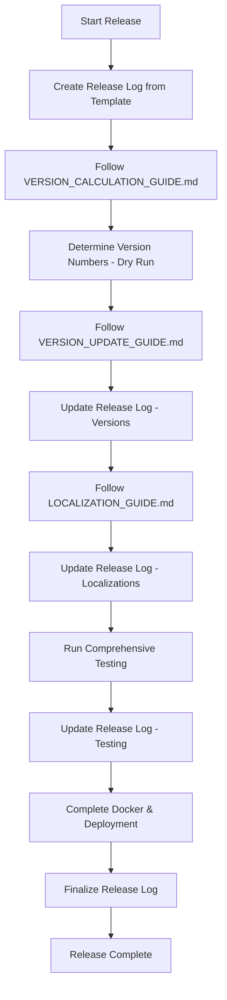

# Complete Release Guide for Couchbase Query Analyzer

This guide orchestrates a full release process by combining all other guides and the release logging system. Use this guide when you want to create a new version release that includes version updates, localization updates, and complete documentation.

## 🎯 When to Use This Guide

**Use RELEASE_GUIDE.md when:**
- Creating a new version release (MAJOR, MINOR, or PATCH)
- You want to update versions AND ensure all localizations are current
- You need a complete release with full documentation and testing
- You want a comprehensive log of all changes made

**Use individual guides when:**
- Testing version updates without localization ([VERSION_UPDATE_GUIDE.md](VERSION_UPDATE_GUIDE.md))
- Testing localization without version changes ([LOCALIZATION_GUIDE.md](LOCALIZATION_GUIDE.md))
- Making isolated changes to specific components

## 🔄 Complete Release Process

### Step 0: Initialize Release Log
```bash
# Create timestamped release log from template
cp settings/release.template settings/release_$(date +%Y%m%d_%H%M%S).txt

# Open the release log file - you'll update this throughout the process
```

**📝 CRITICAL:** Keep your release log file open and update it after each major step. This creates a permanent record of your release process.

### Step 1: Determine Version Number  
First, calculate what version number you'll be releasing:

1. **Open:** [VERSION_CALCULATION_GUIDE.md](VERSION_CALCULATION_GUIDE.md)
2. **Complete:** Full change analysis and version calculation
3. **Document:** Your version decision and reasoning
4. **Result:** You should have your old and new version numbers ready

### Step 2: Follow VERSION_UPDATE_GUIDE.md
Execute the complete version update process:

1. **Open:** [VERSION_UPDATE_GUIDE.md](VERSION_UPDATE_GUIDE.md)
2. **Follow:** All steps from "Step 2: Update HTML Files" through "Step 5: Verification" (Step 1 is now done)
3. **Update release log:** Check off each item in the "HTML Files Updates" and "Documentation Updates" sections
4. **Important:** The VERSION_UPDATE_GUIDE already includes release log instructions

**Expected Outcome:**
- All HTML files updated with new version numbers
- All documentation (AGENT.md, README files) updated with new version
- Docker files updated with new version
- All version consistency checks passed

### Step 3: Follow LOCALIZATION_GUIDE.md
Ensure all localizations are current and complete:

1. **Open:** [LOCALIZATION_GUIDE.md](LOCALIZATION_GUIDE.md)
2. **Execute:** README Files maintenance (if needed)
3. **Execute:** HTML Tools synchronization (if needed)
4. **Run:** Post-translation audit system to verify completeness
5. **Update release log:** Check off localization verification items

**Expected Outcome:**
- All README files synchronized across languages
- All HTML files have complete translations
- Translation audit shows 95%+ completion
- All language versions tested and functional

### Step 4: Comprehensive Release Testing
Using your release log file, verify all components:

#### Version Consistency Verification
Run the commands from your release log's "Version Consistency Checks" section:
```bash
grep -r "name=\"version\"" *.html
grep -r "<title>" *.html  
grep -r "version-info" *.html
grep -r "APP_VERSION" *.html
grep -r "# Couchbase Slow Query Analysis Tool" README*.md AGENT.md
```

#### Functional Testing
Test each component listed in your release log's "Functional Testing" section:
- [ ] English (index.html) loads and functions
- [ ] German (de/index.html) loads with translations
- [ ] Spanish (es/index.html) loads with translations  
- [ ] Portuguese (pt/index.html) loads with translations
- [ ] All charts display correctly
- [ ] All buttons function properly
- [ ] No JavaScript console errors

#### Localization Verification
Run the commands from your release log's "Localization Verification" section:
```bash
grep -n ">Dashboard<\|>Timeline<\|>Analysis<" de/index.html
grep -n ">Dashboard<\|>Timeline<\|>Analysis<" es/index.html
grep -n ">Dashboard<\|>Timeline<\|>Analysis<" pt/index.html
grep -n "Copy</button>" */index.html
grep -n ">Copy<\|>Show<\|>Hide<\|>Reset<" */index.html
```

### Step 5: Docker & Deployment
Complete the deployment preparation:

1. **Verify Docker files:** Check Dockerfile and GitHub Actions workflow versions
2. **Plan Docker Hub cleanup:** Note old versions to remove in release log
3. **Update release log:** Complete "Docker & Deployment Updates" section

### Step 6: Final Release Documentation
Complete your release log:

1. **Fill Additional Notes:** Document any issues or special considerations
2. **Complete Files Modified:** Check off all modified files
3. **Finalize Release Complete section:** Add your name and completion date
4. **Save release log:** This becomes your permanent release record

## 🚨 Release Quality Gates

Before marking a release complete, ALL of these must pass:

### ✅ Version Consistency
- [ ] All HTML files show identical version numbers
- [ ] All README files show identical version numbers  
- [ ] AGENT.md shows correct version
- [ ] Docker files show correct version
- [ ] JavaScript constants match meta tags

### ✅ Localization Quality
- [ ] No English text found in German/Spanish/Portuguese files
- [ ] All dynamic content displays in correct languages
- [ ] All chart configurations translated
- [ ] No JavaScript errors in any language version

### ✅ Functional Quality  
- [ ] All HTML files load without errors
- [ ] All interactive elements work correctly
- [ ] All charts display with proper styling
- [ ] All copy/paste functionality works
- [ ] All search and filter functions work

### ✅ Documentation Quality
- [ ] Release notes added to all README files
- [ ] Quick Start sections positioned correctly
- [ ] Language navigation links functional
- [ ] Spell checking completed on all files

## 📁 File Dependencies

This release guide coordinates these files:

### Process Guides
- **[WORKFLOW_GUIDE.md](WORKFLOW_GUIDE.md)** - Complete development workflow with release branches
- **[VERSION_CALCULATION_GUIDE.md](VERSION_CALCULATION_GUIDE.md)** - Determine version numbers (dry run)
- **[VERSION_UPDATE_GUIDE.md](VERSION_UPDATE_GUIDE.md)** - Version number updates
- **[LOCALIZATION_GUIDE.md](LOCALIZATION_GUIDE.md)** - Translation maintenance
- **[settings/translations.json](translations.json)** - Translation mappings

### Templates & Logs
- **[release.template](release.template)** - Release log template (copied, not modified)
- **release_YYYYMMDD_HHMMSS.txt** - Your specific release log (created from template)

### Target Files (Updated During Release)
- **HTML Files:** `index.html`, `de/index.html`, `es/index.html`, `pt/index.html`
- **Documentation:** `AGENT.md`, `README.md`, `README.de.md`, `README.es.md`, `README.pt.md`
- **Docker:** `Dockerfile`, `.github/workflows/docker-build-push.yml`

## 🔄 Workflow Summary



## 🎯 Success Criteria

A successful release using this guide will have:

1. **Complete Release Log:** All sections filled out with actual values
2. **Version Consistency:** All files show the same new version
3. **Localization Completeness:** All language versions fully translated and functional
4. **Quality Assurance:** All testing passes without issues
5. **Documentation Current:** All README files updated with release notes
6. **Deployment Ready:** Docker files prepared with correct version tags

## 🔧 Troubleshooting

### If VERSION_UPDATE_GUIDE.md fails:
- Check your release log to see which step failed
- Fix the issue and resume from that step
- Update release log with notes about the problem

### If LOCALIZATION_GUIDE.md fails:
- Use the translation audit system to identify missing translations
- Update settings/translations.json if needed
- Re-run the localization process
- Document issues in release log

### If testing fails:
- Check JavaScript console for errors
- Verify file paths and references are correct
- Test each language version individually
- Document failures and fixes in release log

---

**Remember:** This guide coordinates the other guides - always refer back to the individual guides for detailed instructions. Your release log is your permanent record of what was accomplished.
