# Complete Release Guide for Couchbase Query Analyzer

This guide orchestrates a full release process by combining all other guides and the release logging system. Use this guide when you want to create a new version release that includes version updates, localization updates, and complete documentation.

## 🎯 When to Use This Guide

**Use RELEASE_GUIDE.md when:**
- Creating a new version release (MAJOR, MINOR, or PATCH)
- You want to update versions AND ensure all localizations are current
- You need a complete release with full documentation and testing
- You want a comprehensive log of all changes made

**Use individual guides when:**
- Testing version updates without localization ([VERSION_UPDATE_GUIDE.md](VERSION_UPDATE_GUIDE.md))
- Testing localization without version changes ([LOCALIZATION_GUIDE.md](LOCALIZATION_GUIDE.md))
- Making isolated changes to specific components

## 🔄 Complete Release Process

### **Step 1: Initialize Release Log**
```bash
# Create timestamped release log from template in logs folder
cp settings/release.template settings/logs/release_$(date +%Y%m%d_%H%M%S).txt

# Open the release log file - you'll update this throughout the process
```

**📝 CRITICAL:** Keep your release log file open and update it after each major step. This creates a permanent record of your release process.

### **Step 2: Determine Version Number**  
First, calculate what version number you'll be releasing:

1. **Open:** [VERSION_CALCULATION_GUIDE.md](VERSION_CALCULATION_GUIDE.md)
2. **Follow:** VERSION_CALCULATION_GUIDE.md Step 1 through Step 4
3. **Analyze Git History:** Check for recent issue-related merges using the git commands in the guide
4. **Read GitHub Issues:** Review issues at https://github.com/Fujio-Turner/cb_completed_request/issues for context on recent fixes/features
5. **Complete:** Full change analysis and version calculation with issue references
6. **Document:** Your version decision, reasoning, and GitHub issue links
7. **Result:** You should have your old and new version numbers ready with issue-based context

### **Step 3: Follow VERSION_UPDATE_GUIDE.md**
Execute the complete version update process:

1. **Open:** [VERSION_UPDATE_GUIDE.md](VERSION_UPDATE_GUIDE.md)
2. **Follow:** VERSION_UPDATE_GUIDE.md Step 2 through Step 6 (Step 1 is now done from our Step 2 above)
3. **Update release log:** Check off each item in the "HTML Files Updates" and "Documentation Updates" sections
4. **Important:** The VERSION_UPDATE_GUIDE already includes release log instructions

**Expected Outcome:**
- All HTML files updated with new version numbers
- All documentation (AGENT.md, README files) updated with new version
- Docker files updated with new version
- All version consistency checks passed

### **Step 4: Follow LOCALIZATION_GUIDE.md**
Ensure all localizations are current and complete:

1. **Open:** [LOCALIZATION_GUIDE.md](LOCALIZATION_GUIDE.md)
2. **Execute:** LOCALIZATION_GUIDE.md Step 1-2 for README Files maintenance (if needed)
3. **Execute:** LOCALIZATION_GUIDE.md Step 3-4 for HTML Tools synchronization using **COMPLETE REPLACEMENT METHOD**:
   - **Create backups** of existing localized files: `cp de/index.html de/index.html.backup`
   - **Copy en/index.html** to all language directories: `cp en/index.html de/index.html`
   - **Re-translate entire files** using translation system (do NOT try to selectively copy features)
   - **Verify functionality** is identical across all language versions
4. **🚨 CRITICAL:** JavaScript Syntax Validation: `python3 python/validate_js_syntax.py`
5. **Run:** LOCALIZATION_GUIDE.md Step 5-6 for comprehensive verification including post-translation audit system
6. **Update release log:** Check off localization verification items

**⚠️ CRITICAL:** When new features are added to en/index.html, localized versions MUST be completely replaced and re-translated, not selectively updated.

**Expected Outcome:**
- All README files synchronized across languages with current release notes
- All HTML files have complete translations AND identical functionality 
- Translation audit shows 95%+ completion
- All language versions tested and functional
- **All language versions contain the same features as English version**

### **Step 5: Comprehensive Release Testing**
🚨 **MANDATORY:** Run the complete verification script before proceeding:

```bash
# Run the comprehensive verification tool
python3 python/RELEASE_WORK_CHECK.py
```

If ANY issues are found, **STOP** and fix them before continuing. Common issues to expect:

#### 🔧 **Expected Issue 1: Version Inconsistencies**
**Symptom:** Different version numbers across files
**Fix:** Update all files to match target version:
```bash
# Fix meta version tags
sed -i '' 's/content="OLD_VERSION"/content="NEW_VERSION"/g' */index.html
# Fix JavaScript constants  
sed -i '' 's/APP_VERSION = "OLD_VERSION"/APP_VERSION = "NEW_VERSION"/g' */index.html
# Fix last-updated dates
sed -i '' 's/LAST_UPDATED = "OLD_DATE"/LAST_UPDATED = "NEW_DATE"/g' */index.html
```

#### 🔧 **Expected Issue 2: Missing Version Meta Tags**
**Symptom:** Main index.html missing version/last-updated meta tags
**Fix:** Add required meta tags to main index.html:
```html
<meta name="version" content="X.X.X" />
<meta name="last-updated" content="YYYY-MM-DD" />
```

#### 🔧 **Expected Issue 3: JavaScript Syntax Errors**
**Symptom:** Translation scripts break JavaScript syntax
**Fix:** Always validate and fix after translations:
```bash
python3 python/validate_js_syntax.py
python3 python/fix_js_strings.py  # If validation fails
```

#### 🔧 **Expected Issue 4: English Text in Non-English Files**  
**Symptom:** Buttons, labels, constants still in English
**Fix:** Apply comprehensive translations:
```bash
# Method 1: Copy English files and re-translate (RECOMMENDED)
cp en/index.html de/index.html es/index.html pt/index.html
python3 python/apply_safe_translations.py

# Method 2: Apply comprehensive translations to existing files
python3 python/apply_comprehensive_insights_translations.py
```

#### 🔧 **Expected Issue 5: HTML Structure Inconsistencies**
**Symptom:** Script tag mismatches or missing elements
**Fix:** Verify HTML structure after translations:
```bash
for file in *.html */index.html; do
  echo "=== $file ==="
  echo "DOCTYPE: $(grep -c DOCTYPE "$file")"
  echo "Script open: $(grep -c "<script" "$file")"  
  echo "Script close: $(grep -c "</script>" "$file")"
done
```

#### **MANDATORY Re-Verification**
After fixing issues, **MUST** re-run verification:
```bash
python3 python/RELEASE_WORK_CHECK.py
```
**Only proceed when ALL checks pass.**

### **Step 6: Docker & Deployment**
Complete the deployment preparation:

1. **Verify Docker files:** Check Dockerfile and GitHub Actions workflow versions
2. **Plan Docker Hub cleanup:** Note old versions to remove in release log
3. **Update release log:** Complete "Docker & Deployment Updates" section

### **Step 7: Final Release Documentation**
Complete your release log and documentation:

1. **🚨 CRITICAL - Add Release Notes to All README Files:**
   ```bash
   # Use automated release notes script (recommended)
   python3 python/add_release_notes.py
   # OR manually add to README.md, de/README.de.md, es/README.es.md, pt/README.pt.md
   ```

2. **Fill Additional Notes:** Document any issues or special considerations, including GitHub issue references
3. **Complete Files Modified:** Check off all modified files including README files
4. **Add GitHub Context:** Document which GitHub issues were resolved or addressed in this release
5. **Finalize Release Complete section:** Add your name and completion date
6. **Save release log:** This becomes your permanent release record with issue tracking

## 🚨 Release Quality Gates

Before marking a release complete, ALL of these must pass:

### ✅ Version Consistency
- [ ] All HTML files show identical version numbers
- [ ] All README files show identical version numbers  
- [ ] AGENT.md shows correct version
- [ ] Docker files show correct version
- [ ] JavaScript constants match meta tags

### ✅ Localization Quality
- [ ] No English text found in German/Spanish/Portuguese files
- [ ] All dynamic content displays in correct languages
- [ ] All chart configurations translated
- [ ] No JavaScript errors in any language version

### ✅ Functional Quality  
- [ ] All HTML files load without errors
- [ ] All interactive elements work correctly
- [ ] All charts display with proper styling
- [ ] All copy/paste functionality works
- [ ] All search and filter functions work

### ✅ Documentation Quality
- [ ] **🚨 CRITICAL: Release notes added to all README files** (README.md, de/README.de.md, es/README.es.md, pt/README.pt.md)
- [ ] Quick Start sections positioned correctly
- [ ] Language navigation links functional
- [ ] Spell checking completed on all files

## 📁 File Dependencies

This release guide coordinates these files:

### Process Guides
- **[WORKFLOW_GUIDE.md](WORKFLOW_GUIDE.md)** - Complete development workflow with release branches
- **[VERSION_CALCULATION_GUIDE.md](VERSION_CALCULATION_GUIDE.md)** - Determine version numbers (dry run)
- **[VERSION_UPDATE_GUIDE.md](VERSION_UPDATE_GUIDE.md)** - Version number updates
- **[LOCALIZATION_GUIDE.md](LOCALIZATION_GUIDE.md)** - Translation maintenance
- **[RELEASE_TROUBLESHOOTING_GUIDE.md](RELEASE_TROUBLESHOOTING_GUIDE.md)** - Common issues and fixes
- **[settings/translations.json](translations.json)** - Translation mappings

### Verification Tools
- **[../python/RELEASE_WORK_CHECK.py](../python/RELEASE_WORK_CHECK.py)** - 🚨 Automated verification script (MANDATORY)
- **[../python/validate_js_syntax.py](../python/validate_js_syntax.py)** - JavaScript syntax validation
- **[../python/fix_js_strings.py](../python/fix_js_strings.py)** - JavaScript syntax repair tool

### Templates & Logs
- **[release.template](release.template)** - Release log template (copied, not modified)
- **logs/release_YYYYMMDD_HHMMSS.txt** - Your specific release log (created from template in logs folder)

### Target Files (Updated During Release)
- **HTML Files:** `index.html`, `en/index.html`, `de/index.html`, `es/index.html`, `pt/index.html`
- **Documentation:** `AGENT.md`, `README.md`, `de/README.de.md`, `es/README.es.md`, `pt/README.pt.md`
- **Docker:** `Dockerfile`, `.github/workflows/docker-build-push.yml`

## 🔄 Workflow Summary

```mermaid
graph TD
    A[Start Release] --> B[Create Release Log from Template]
    B --> C[Follow VERSION_CALCULATION_GUIDE.md]
    C --> D[Determine Version Numbers - Dry Run]
    D --> E[Follow VERSION_UPDATE_GUIDE.md]
    E --> F[Update Release Log - Versions]
    F --> G[Follow LOCALIZATION_GUIDE.md] 
    G --> H[Update Release Log - Localizations]
    H --> I[🚨 MANDATORY: Run RELEASE_WORK_CHECK.py]
    I --> J{All Checks Pass?}
    J -->|❌ NO| K[Fix Issues]
    K --> I
    J -->|✅ YES| L[Complete Docker & Deployment]
    L --> M[Finalize Release Log]
    M --> N[Release Complete]
```



## 🎯 Success Criteria

A successful release using this guide will have:

1. **Complete Release Log:** All sections filled out with actual values
2. **Version Consistency:** All files show the same new version
3. **Localization Completeness:** All language versions fully translated and functional
4. **Quality Assurance:** All testing passes without issues
5. **Documentation Current:** All README files updated with release notes
6. **Deployment Ready:** Docker files prepared with correct version tags

## 🔧 Troubleshooting

**🚨 For detailed troubleshooting with specific fixes, see [RELEASE_TROUBLESHOOTING_GUIDE.md](RELEASE_TROUBLESHOOTING_GUIDE.md)**

### Quick Fixes for Common Issues:

#### VERSION_UPDATE_GUIDE.md fails:
```bash
# Fix version inconsistencies across all files
sed -i '' 's/content="OLD_VERSION"/content="NEW_VERSION"/g' *.html */index.html
sed -i '' 's/APP_VERSION = "OLD_VERSION"/APP_VERSION = "NEW_VERSION"/g' */index.html
```

#### LOCALIZATION_GUIDE.md fails:
```bash
# Nuclear option: Start fresh with clean translations
cp en/index.html de/index.html es/index.html pt/index.html
python3 python/apply_safe_translations.py
python3 python/validate_js_syntax.py
```

#### JavaScript syntax errors:
```bash
# Fix broken strings from translations
python3 python/fix_js_strings.py
python3 python/validate_js_syntax.py
```

#### Comprehensive issues:
```bash
# Run full verification and get specific error details
python3 python/RELEASE_WORK_CHECK.py [VERSION]
```

**📚 See [RELEASE_TROUBLESHOOTING_GUIDE.md](RELEASE_TROUBLESHOOTING_GUIDE.md) for complete solutions to all known issues.**

### If localized HTML files are missing new features:
**🚨 COMMON ISSUE:** Localized files (de/index.html, es/index.html, pt/index.html) missing functionality that exists in en/index.html

**Root Cause:** Selective feature copying instead of complete file replacement

**Solution:**
1. **Backup existing files:** `cp de/index.html de/index.html.backup` (repeat for es/ and pt/)
2. **Replace with English version:** `cp en/index.html de/index.html` (repeat for es/ and pt/)
3. **Re-translate completely:** Use translation system to translate entire file
4. **Verify feature parity:** Ensure all tabs/functionality exist in all language versions
5. **Update release log:** Document the complete replacement approach used

**Prevention:** Always use complete file replacement method when en/index.html gets new features

---

**Remember:** This guide coordinates the other guides - always refer back to the individual guides for detailed instructions. Your release log is your permanent record of what was accomplished.
