# Complete Release Guide for Couchbase Query Analyzer

> **⚠️ REQUIRED**: Run Playwright tests before release: `npm run test:e2e`  
> All tests must pass. See [TESTING_WORKFLOW.md](./TESTING_WORKFLOW.md) for details.

This guide orchestrates a full release process by combining all other guides and the release logging system. Use this guide when you want to create a new version release that includes version updates, localization updates, and complete documentation.

## 🎯 When to Use This Guide

**Use RELEASE_GUIDE.md when:**
- Creating a new version release (MAJOR, MINOR, or PATCH)
- You want to update versions AND ensure all localizations are current
- You need a complete release with full documentation and testing
- You want a comprehensive log of all changes made

**Use individual guides when:**
- Testing version updates without localization ([VERSION_UPDATE_GUIDE.md](VERSION_UPDATE_GUIDE.md))
- Testing localization without version changes ([LOCALIZATION_GUIDE.md](LOCALIZATION_GUIDE.md))
- Making isolated changes to specific components

## 🔄 Complete Release Process

### **Step 0: Run E2E Tests FIRST (Before Any Changes)**

🚨 **CRITICAL:** Run Playwright tests **BEFORE** updating any version numbers or files. If tests fail, you can fix them on a separate branch without having to revert version changes.

```bash
# Run full E2E test suite
npm run test:e2e
```

**All tests must pass before proceeding!** If tests fail:
1. Create a separate branch for test fixes: `git checkout -b fix/e2e-tests`
2. Fix the failing tests
3. Commit and merge the fixes
4. Return to this guide and start over

**Why test first?**
- Prevents wasted work updating versions if code has issues
- Allows you to fix problems on a separate branch
- Ensures release candidate is actually working before version bump

See [TESTING_WORKFLOW.md](./TESTING_WORKFLOW.md) and [PLAYWRIGHT_TESTING.md](../PLAYWRIGHT_TESTING.md) for details.

### **Step 1: Remove Dev Build Banner (If Present)**

If you're releasing from a post-release development branch, remove the dev banner:

```bash
# Check if dev banner exists
if grep -q "DEV BUILD BANNER" index.html; then
    echo "⚠️  Found dev build banner - removing..."
    
    # Remove banner from index.html
    sed -i '' '/<!-- DEV BUILD BANNER/,/<!-- END DEV BUILD BANNER -->/d' index.html
    
    # Remove banner from en/index.html
    sed -i '' '/<!-- DEV BUILD BANNER/,/<!-- END DEV BUILD BANNER -->/d' en/index.html
    
    echo "✅ Dev banner removed"
else
    echo "✅ No dev banner found"
fi

# Verify removal
grep "DEV BUILD BANNER" index.html en/index.html
# Should return nothing (or "No such file or directory" which is fine)
```

**⚠️ CRITICAL:** Release cannot proceed with dev banner present! The RELEASE_WORK_CHECK.py script will fail if the banner is still there.

### **Step 2: Initialize Release Log**
```bash
# Create timestamped release log from template in logs folder
cp settings/release.template settings/logs/release_$(date +%Y%m%d_%H%M%S).txt

# Open the release log file - you'll update this throughout the process
```

**📝 CRITICAL:** Keep your release log file open and update it after each major step. This creates a permanent record of your release process.

### **Step 3: Determine Version Number**  
First, calculate what version number you'll be releasing:

1. **Open:** [VERSION_CALCULATION_GUIDE.md](VERSION_CALCULATION_GUIDE.md)
2. **Follow:** VERSION_CALCULATION_GUIDE.md Step 1 through Step 4
3. **Analyze Git History:** Check for recent issue-related merges using the git commands in the guide
4. **Read GitHub Issues:** Review issues at https://github.com/Fujio-Turner/cb_completed_request/issues for context on recent fixes/features
5. **Complete:** Full change analysis and version calculation with issue references
6. **Document:** Your version decision, reasoning, and GitHub issue links
7. **Result:** You should have your old and new version numbers ready with issue-based context

### **Step 4: Follow VERSION_UPDATE_GUIDE.md**
Execute the complete version update process:

1. **Open:** [VERSION_UPDATE_GUIDE.md](VERSION_UPDATE_GUIDE.md)
2. **Follow:** VERSION_UPDATE_GUIDE.md Step 2 through Step 6 (Step 1 is now done from our Step 2 above)
3. **Update release log:** Check off each item in the "HTML Files Updates" and "Documentation Updates" sections
4. **Important:** The VERSION_UPDATE_GUIDE already includes release log instructions

**Expected Outcome:**
- All HTML files updated with new version numbers
- All documentation (AGENT.md, README files, release_notes.md) updated with new version
- Docker files updated with new version
- All version consistency checks passed

### Header Comment Block in en/index.html (Version + Date)
The English HTML includes a header comment with version and date. Update both on every release, in addition to meta tags and JS constants:

```html
<!--
    Couchbase Query Analyzer
    Version: X.X.X
    Last Updated: YYYY-MM-DD
    
    🤖 AI AGENT NOTE: When updating versions, follow the detailed guide in settings/VERSION_UPDATE_GUIDE.md
    This guide covers all HTML elements, JavaScript variables, and documentation files that need updating.
    Load and do what the AGENT.md file before working on this file.

    Use semantic versioning: MAJOR.MINOR.PATCH
    - MAJOR: Breaking changes or complete rewrites
    - MINOR: New features, significant enhancements  
    - PATCH: Bug fixes, small improvements
    
-->
```

- Set `Version:` to the exact release version (e.g., `3.13.0`).
- Set `Last Updated:` to the release date in `YYYY-MM-DD` (e.g., `2025-09-09`).

Verification:

```bash
# Spot check the header comment values
grep -n "^\s*Version:" en/index.html
grep -n "^\s*Last Updated:" en/index.html
```

Optional automation:

```bash
# Update just the English file
sed -i '' 's/^\s*Version: .*/    Version: NEW_VERSION/' en/index.html
sed -i '' 's/^\s*Last Updated: .*/    Last Updated: YYYY-MM-DD/' en/index.html


```

### **Step 5: English-only Release (no localization step)**
As of v3.13.x, we only ship the English tool. Do NOT run settings/LOCALIZATION_GUIDE.md.

Do this instead:
- Ensure these HTML files are updated: `index.html` and `en/index.html`.
- Update version meta tags, title, version-info div, and JS constants in both files.
- Update the header comment in `en/index.html` (Version and Last Updated).
- Note: `analysis_hub.html` has no version info and does not need updating.
- Skip any copying or translating to `de/`, `es/`, or `pt/`.
- Run JavaScript syntax validation: `python3 python/validate_js_syntax.py`.

Expected Outcome:
- English-only artifacts updated and consistent (index.html, en/index.html, and analysis_hub.html)
- No references to localized HTML files remain in index.html navigation

### **Step 6: Comprehensive Release Testing**
🚨 **MANDATORY:** Run the complete verification script before proceeding:

```bash
# Run the comprehensive verification tool
python3 python/RELEASE_WORK_CHECK.py
```

If ANY issues are found, **STOP** and fix them before continuing. Common issues to expect:

#### 🔧 **Expected Issue 1: Version Inconsistencies**
**Symptom:** Different version numbers across files
**Fix:** Update all files to match target version:
```bash
# Fix meta version tags
sed -i '' 's/content="OLD_VERSION"/content="NEW_VERSION"/g' */index.html
# Fix JavaScript constants  
sed -i '' 's/APP_VERSION = "OLD_VERSION"/APP_VERSION = "NEW_VERSION"/g' */index.html
# Fix last-updated dates
sed -i '' 's/LAST_UPDATED = "OLD_DATE"/LAST_UPDATED = "NEW_DATE"/g' */index.html
```

#### 🔧 **Expected Issue 2: Missing Version Meta Tags**
**Symptom:** Main index.html missing version/last-updated meta tags
**Fix:** Add required meta tags to main index.html:
```html
<meta name="version" content="X.X.X" />
<meta name="last-updated" content="YYYY-MM-DD" />
```

#### 🔧 **Expected Issue 3: JavaScript Syntax Errors**
**Symptom:** Translation scripts break JavaScript syntax
**Fix:** Always validate and fix after translations:
```bash
python3 python/validate_js_syntax.py
python3 python/fix_js_strings.py  # If validation fails
```

#### 🔧 **Expected Issue 4: N/A (Localization removed)**
Localization checks are no longer applicable. We only ship `index.html` and `en/index.html`.

#### 🔧 **Expected Issue 5: HTML Structure Inconsistencies**
**Symptom:** Script tag mismatches or missing elements
**Fix:** Verify HTML structure after translations:
```bash
for file in *.html */index.html; do
  echo "=== $file ==="
  echo "DOCTYPE: $(grep -c DOCTYPE "$file")"
  echo "Script open: $(grep -c "<script" "$file")"  
  echo "Script close: $(grep -c "</script>" "$file")"
done
```

#### 🔧 **Expected Issue 6: Header Comment Block Outdated**
**Symptom:** Header comment in en/index.html shows an older `Version:` or `Last Updated:` value than the release
**Fix:** Update the header comment to match the release version/date
```bash
# Update English header comment to match the release
sed -i '' 's/^\s*Version: .*/    Version: NEW_VERSION/' en/index.html
sed -i '' 's/^\s*Last Updated: .*/    Last Updated: YYYY-MM-DD/' en/index.html

# Verify
grep -n "^\s*Version:" en/index.html
grep -n "^\s*Last Updated:" en/index.html
```

#### **MANDATORY Re-Verification**
After fixing issues, **MUST** re-run verification:
```bash
python3 python/RELEASE_WORK_CHECK.py
```
**Only proceed when ALL checks pass.**

### **Step 7: Docker & Deployment**
Complete the deployment preparation:

1. **Verify Docker files:** Check Dockerfile and GitHub Actions workflow versions
2. **Plan Docker Hub cleanup:** Note old versions to remove in release log
3. **Update release log:** Complete "Docker & Deployment Updates" section

### **Step 8: Final Release Documentation**
Complete your release log and documentation:

1. **🚨 CRITICAL - Update Release Notes:**
   - Update `release_notes.md` with the latest entries for this version.
- Ensure the README Release Notes section links to `release_notes.md`.
- Optional: use `python3 python/add_release_notes.py` to draft content, then paste/adapt into `release_notes.md`.

2. **Fill Additional Notes:** Document any issues or special considerations, including GitHub issue references
3. **Complete Files Modified:** Check off all modified files including README files
4. **Add GitHub Context:** Document which GitHub issues were resolved or addressed in this release
5. **Finalize Release Complete section:** Add your name and completion date
6. **Save release log:** This becomes your permanent release record with issue tracking

## 🚨 Release Quality Gates

Before marking a release complete, ALL of these must pass:

### ✅ Version Consistency
- [ ] All HTML files show identical version numbers
- [ ] All README files show identical version numbers  
- [ ] AGENT.md shows correct version
- [ ] Docker files show correct version
- [ ] JavaScript constants match meta tags
- [ ] en/index.html header comment shows correct Version and Last Updated


### ✅ Functional Quality  
- [ ] All HTML files load without errors
- [ ] All interactive elements work correctly
- [ ] All charts display with proper styling
- [ ] All copy/paste functionality works
- [ ] All search and filter functions work

### ✅ Documentation Quality
- [ ] **🚨 CRITICAL: release_notes.md updated and linked from README.md**
- [ ] Quick Start section positioned correctly
- [ ] Spell checking completed on all files

## 📁 File Dependencies

This release guide coordinates these files:

### Process Guides
- **[WORKFLOW_GUIDE.md](WORKFLOW_GUIDE.md)** - Complete development workflow with release branches
- **[VERSION_CALCULATION_GUIDE.md](VERSION_CALCULATION_GUIDE.md)** - Determine version numbers (dry run)
- **[VERSION_UPDATE_GUIDE.md](VERSION_UPDATE_GUIDE.md)** - Version number updates
- **[LOCALIZATION_GUIDE.md](LOCALIZATION_GUIDE.md)** - Translation maintenance
- **[RELEASE_TROUBLESHOOTING_GUIDE.md](RELEASE_TROUBLESHOOTING_GUIDE.md)** - Common issues and fixes
- **[settings/translations.json](translations.json)** - Translation mappings

### Verification Tools
- **[../python/RELEASE_WORK_CHECK.py](../python/RELEASE_WORK_CHECK.py)** - 🚨 Automated verification script (MANDATORY)
- **[../python/validate_js_syntax.py](../python/validate_js_syntax.py)** - JavaScript syntax validation
- **[../python/fix_js_strings.py](../python/fix_js_strings.py)** - JavaScript syntax repair tool

### Templates & Logs
- **[release.template](release.template)** - Release log template (copied, not modified)
- **logs/release_YYYYMMDD_HHMMSS.txt** - Your specific release log (created from template in logs folder)

### Target Files (Updated During Release)
- **HTML Files:** `index.html`, `en/index.html` (Note: `analysis_hub.html` is version-agnostic)
- **Documentation:** `AGENT.md`, `README.md`, `release_notes.md`
- **Docker:** `Dockerfile`, `.github/workflows/docker-build-push.yml`

## 🔄 Workflow Summary

```mermaid
graph TD
    A[Start Release] --> B[🚨 Run E2E Tests FIRST]
    B --> C{Tests Pass?}
    C -->|❌ NO| D[Fix on Separate Branch]
    D --> A
    C -->|✅ YES| E[Remove Dev Banner]
    E --> F[Create Release Log from Template]
    F --> G[Follow VERSION_CALCULATION_GUIDE.md]
    G --> H[Determine Version Numbers - Dry Run]
    H --> I[Follow VERSION_UPDATE_GUIDE.md]
    I --> J[Update Release Log - Versions]
    J --> K[🚨 MANDATORY: Run RELEASE_WORK_CHECK.py]
    K --> L{All Checks Pass?}
    L -->|❌ NO| M[Fix Issues]
    M --> K
    L -->|✅ YES| N[Complete Docker & Deployment]
    N --> O[Finalize Release Log]
    O --> P[Release Complete]
```



## 🎯 Success Criteria

A successful release using this guide will have:

1. **Complete Release Log:** All sections filled out with actual values
2. **Version Consistency:** All files show the same new version
3. **Quality Assurance:** All testing passes without issues
4. **Documentation Current:** README.md updated with release notes
5. **Deployment Ready:** Docker files prepared with correct version tags

## 🔧 Troubleshooting

**🚨 For detailed troubleshooting with specific fixes, see [RELEASE_TROUBLESHOOTING_GUIDE.md](RELEASE_TROUBLESHOOTING_GUIDE.md)**

### Quick Fixes for Common Issues:

#### VERSION_UPDATE_GUIDE.md fails:
```bash
# Fix version inconsistencies across all files
sed -i '' 's/content="OLD_VERSION"/content="NEW_VERSION"/g' *.html */index.html
sed -i '' 's/APP_VERSION = "OLD_VERSION"/APP_VERSION = "NEW_VERSION"/g' */index.html
```

#### Localization-related steps
Not applicable. As of v3.13.x, localization is no longer part of the release process.

#### JavaScript syntax errors:
```bash
# Fix broken strings from translations
python3 python/fix_js_strings.py
python3 python/validate_js_syntax.py
```

#### Comprehensive issues:
```bash
# Run full verification and get specific error details
python3 python/RELEASE_WORK_CHECK.py [VERSION]
```

**📚 See [RELEASE_TROUBLESHOOTING_GUIDE.md](RELEASE_TROUBLESHOOTING_GUIDE.md) for complete solutions to all known issues.**

### Localization status
As of v3.13.x, multi-language HTML builds are discontinued. Only `index.html` and `en/index.html` are maintained and released.

---

**Remember:** This guide coordinates the other guides - always refer back to the individual guides for detailed instructions. Your release log is your permanent record of what was accomplished.
