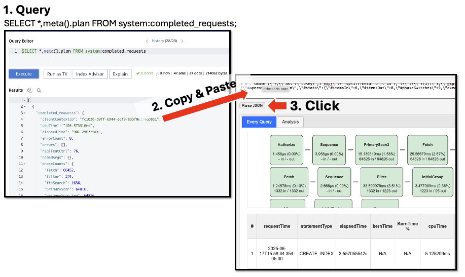

# My Project Documentation

Below is the documentation for this project, available in multiple languages. Click the tabs to switch between languages.

  <button class="tablinks active" onclick="openLang(event, 'EN')">EN</button>
  <button class="tablinks" onclick="openLang(event, 'DE')">DE</button>
  <button class="tablinks" onclick="openLang(event, 'ES')">ES</button>
  <button class="tablinks" onclick="openLang(event, 'PT')">PT</button>

<h1>Couchbase Slow Query Analysis Tool v3.1.0</h1>

A comprehensive web-based tool for analyzing Couchbase query performance and execution plans. Visualize query patterns, identify bottlenecks, and optimize database performance with advanced index usage tracking, execution plan analysis, and dedicated index management features.

<h5>(Capella Compatible)</h5>

<h2>Quick Start</h2>

<h3>Step 1: Download the Tool</h3>

Download or clone the whole repository OR just download the <code>index.html</code>

<h3>Step 2: Open in Browser</h3>

Go to the folder where you downloaded the <code>index.html</code> and open it directly in any modern web browser (Chrome, Firefox, Safari, Edge). <i>Firefox</i> seems to be the faster

<h3>Step 3: Extract Query Data</h3>

Run this query in Couchbase Query Workbench or cbq:

<pre><code class="sql">SELECT *, meta().plan FROM system:completed_requests LIMIT 4000;</code></pre>

<strong>Notes</strong>: 
This could return back a JSON of about 36MB~ish. Anything bigger will probably crash the browser. <i>Firefox</i> seems to be the faster browser.

<strong>Browser is slow/crashes:</strong>
If the browser slowes to a crawl reduce the data size via <code>LIMIT 2000</code>

<a href="sql_queries.md">More Query Options</a>

<h3>Step 4: Analyze</h3>

Select ALL & Copy the full JSON results and paste it into the tool's input area up top, then click <button>Parse JSON</button>

<h3>Step 5a: Filter by Date Range (Optional)</h3>

<ul>
<li><strong>Auto-population</strong>: Date fields automatically populate with your data's full time range</li>
<li><strong>Custom filtering</strong>: Adjust "From" and "To" dates to focus on specific time periods</li>
<li><strong>Re-analyze</strong>: Click "Parse JSON" again to apply the date filter</li>
<li><strong>Filter status</strong>: See how many queries match your selected range</li>
</ul>

<h3>Step 5b: Enhanced Index Analysis (Optional)</h3>

Run the query below to get the JSON result. Copy & Paste the results into the 2nd right text input box and click <code>Parse JSON</code> button.

<pre><code class="sql">SELECT 
 s.name,
 s.id,
 s.metadata,
 s.state,
 s.num_replica,
CONCAT("CREATE INDEX ", s.name, " ON ", k, ks, p, w, ";") AS indexString
FROM system:indexes AS s
LET bid = CONCAT("", s.bucket_id, ""),
    sid = CONCAT("", s.scope_id, ""),
    kid = CONCAT("", s.keyspace_id, ""),
    k = NVL2(bid, CONCAT2(".", bid, sid, kid), kid),
    ks = CASE WHEN s.is_primary THEN "" ELSE "(" || CONCAT2(",", s.index_key) || ")" END,
    w = CASE WHEN s.condition IS NOT NULL THEN " WHERE " || REPLACE(s.condition, '"', "'") ELSE "" END,
    p = CASE WHEN s.`partition` IS NOT NULL THEN " PARTITION BY " || s.`partition` ELSE "" END;</code></pre>

<h2>Features</h2>

<h3><strong>Six Analysis Tabs</strong>:</h3>

<h4><strong>1. Dashboard Tab</strong></h4>
<ul>
<li><strong>Query Duration Distribution</strong> bar chart showing performance patterns</li>
<li><strong>Primary Indexes Used</strong> donut chart with intelligent warning system
  <ul>
    <li>Conditional warning display (only appears when primary indexes detected)</li>
    <li>Educational "Learn More" link to Couchbase primary index best practices</li>
    <li>Enhanced visual distinction for production performance awareness</li>
  </ul>
</li>
<li><strong>Query Pattern Features</strong> analysis for performance insights</li>
<li><strong>Users by Query Count</strong> sortable table showing top query generators</li>
<li><strong>Index Usage Count</strong> sortable table tracking index utilization</li>
<li><strong>Statement Type</strong> pie chart (SELECT, INSERT, UPDATE, DELETE breakdown)</li>
<li><strong>Query State</strong> pie chart showing completion status</li>
</ul>

<h4><strong>2. Timeline Tab</strong></h4>
<ul>
<li><strong>Six Interactive Visualizations</strong> in 2x3 grid layout:
  <ul>
    <li><strong>Duration Buckets Chart</strong>: Query duration distribution over time</li>
    <li><strong>Query Types Chart</strong>: Query type breakdown by time periods</li>
    <li><strong>Operations Chart</strong>: Index scans vs document fetches comparison</li>
    <li><strong>Filter Chart</strong>: Filter operations efficiency (IN vs OUT ratios)</li>
    <li><strong>Timeline Chart</strong>: Kernel time percentage distribution over time</li>
    <li><strong>Memory Chart</strong>: Memory usage (MB) over time with query count tracking</li>
  </ul>
</li>
<li><strong>Interactive Controls</strong>:
  <ul>
    <li>Reset Zoom button for chart navigation</li>
    <li>Y-axis scaling (Linear/Logarithmic) options</li>
    <li>Time grouping options (By Optimizer/By Minute/By Second)</li>
    <li>"Use Time Range" filtering button</li>
    <li>Pan/zoom capabilities with drag-to-pan, scroll-to-zoom, drag-box selection</li>
  </ul>
</li>
</ul>

<h4><strong>3. Query Groups Tab</strong> (Analysis)</h4>
<ul>
<li><strong>Aggregated Query Analysis</strong> with normalized statement grouping</li>
<li><strong>Statistical Metrics</strong>: total_count, min/max/avg/median duration</li>
<li><strong>Performance Averages</strong>: avg_fetch, avg_primaryScan, avg_indexScan</li>
<li><strong>User Breakdown</strong>: Shows execution count per user for each query pattern</li>
<li><strong>Smart Normalization</strong>: Replaces string literals and numbers with <code>?</code> placeholders</li>
<li><strong>Filtered Results</strong>: Excludes INFER, ADVISE, CREATE, ALTER INDEX, and SYSTEM queries</li>
</ul>

<h4><strong>4. Every Query Tab</strong></h4>
<ul>
<li><strong>Comprehensive Query Table</strong> with 17 columns:
  <ul>
    <li>Row #, request Time, statement Type, elapsed Time, service Time</li>
    <li>kern Time, KernTime %, cpu Time, memory (MB)</li>
    <li>result Count, result Size, Items from Index Scan</li>
    <li>Doc Fetch Count, Primary Scan Used, state, statement, users</li>
  </ul>
</li>
<li><strong>Interactive Flow Diagrams</strong>:
  <ul>
    <li>Color-coded execution plan visualization</li>
    <li>Operator bubbles showing execTime, servTime, kernTime percentages</li>
    <li>Click operators for detailed statistics modal</li>
    <li>Visual performance indicators (Green < 25%, Yellow 25-50%, Orange 50-75%, Red > 75%)</li>
    <li><strong>Enhanced execution plan parsing</strong> with support for complex nested operators:
      <ul>
        <li>UnionScan and IntersectScan with nested scans arrays</li>
        <li>DistinctScan with embedded IndexScan3 operators</li>
        <li>ExceptAll with first/second properties for set operations</li>
        <li>Subquery execution timings with complete operator trees</li>
      </ul>
    </li>
  </ul>
</li>
<li><strong>Enhanced Table Features</strong>:
  <ul>
    <li>Full column sorting (click headers)</li>
    <li>Fixed 300px width for statement column with auto-truncation</li>
    <li>Statement truncation at 500 characters with "show more/hide" toggles</li>
    <li>Copy button for each statement</li>
    <li>Row highlighting with click-to-select</li>
  </ul>
</li>
<li><strong>Advanced Data Processing</strong>:
  <ul>
    <li>Batch processing of large datasets (1000 queries per batch)</li>
    <li>Real-time progress indicators</li>
    <li>Memory usage tracking from root <code>usedMemory</code> field</li>
    <li>CPU time extraction from root <code>cpuTime</code> field</li>
  </ul>
</li>
</ul>

<h4><strong>5. Index Query Flow Tab</strong></h4>
<ul>
<li><strong>Visual Index-Query Relationships</strong>:
  <ul>
    <li>Interactive flow diagram connecting indexes to queries that use them</li>
    <li>Index usage statistics with scan counts and execution timings</li>
    <li>Query pattern analysis with normalized statement grouping</li>
    <li>Color-coded connections showing usage frequency</li>
  </ul>
</li>
<li><strong>Enhanced Primary Index Detection</strong> (NEW in v3.1.0):
  <ul>
    <li>Improved detection for indexes ending with <code>*_primary</code> pattern</li>
    <li>Visual highlighting with light red background for all primary index variants</li>
    <li>Comprehensive coverage of <code>#primary</code>, <code>bucket_primary</code>, <code>collection_primary</code> formats</li>
    <li>Captures indexes from all operator types (IndexScan3, PrimaryScan3, etc.)</li>
    <li>Handles complex nested structures in execution plans</li>
    <li>Tracks primary index usage and sequential scans</li>
    <li>Supports all Couchbase query execution patterns</li>
  </ul>
</li>
<li><strong>Performance Insights</strong>:
  <ul>
    <li>Index scan timing analysis (min/max/average execution times)</li>
    <li>Query pattern optimization opportunities</li>
    <li>Index usage frequency tracking</li>
    <li>Cross-query index sharing analysis</li>
  </ul>
</li>
</ul>

<h4><strong>6. Indexes Tab</strong> (NEW in v3.0.0)</h4>
<ul>
<li><strong>Comprehensive Index Management</strong>:
  <ul>
    <li>Complete index catalog with metadata (bucket, scope, collection, state, replicas)</li>
    <li>Real-time index usage tracking with "Used" badges for indexes found in query data</li>
    <li>Advanced filtering options: bucket, scope, collection dropdown filters</li>
    <li>Specialized filters: Primary Only, Used Only, No Replicas Only, Never Scanned Only</li>
    <li>Dynamic statistics panel showing index counts and distribution</li>
  </ul>
</li>
<li><strong>Index Data Input</strong>:
  <ul>
    <li>Dedicated input area for index JSON data from <code>system:indexes</code></li>
    <li>Automatic parsing and validation of index metadata</li>
    <li>Cascading dropdown filters that update based on available data</li>
    <li>Instructions and SQL query helper for easy data collection</li>
  </ul>
</li>
<li><strong>Smart Index Consolidation</strong>:
  <ul>
    <li>Automatic consolidation of <code>#primary</code> references with actual primary index names</li>
    <li>Eliminates duplicate entries in index usage counts</li>
    <li>Unified display showing only actual index names (e.g., <code>def_primary</code> instead of both <code>#primary</code> and <code>def_primary</code>)</li>
  </ul>
</li>
<li><strong>Enhanced Query-Index Matching</strong>:
  <ul>
    <li>Cross-references query execution plans with index catalog</li>
    <li>Identifies which indexes are actively used vs. never scanned</li>
    <li>Performance correlation between index design and query execution</li>
    <li>Primary index usage optimization recommendations</li>
  </ul>
</li>
</ul>

<h3><strong>Core Performance Features</strong>:</h3>

<ul>
<li><strong>Memory Analysis</strong>: Accurate memory usage tracking from Couchbase <code>usedMemory</code> field</li>
<li><strong>CPU Time Tracking</strong>: Precise CPU time measurement from <code>cpuTime</code> field</li>
<li><strong>Service Time Analysis</strong>: Service time display in flow diagrams when available</li>
<li><strong>Primary Scan Detection</strong>: Automatic identification of primary index usage</li>
<li><strong>Advanced Index Usage Analysis</strong>:
  <ul>
    <li>Comprehensive primary vs secondary index tracking</li>
    <li>Support for complex execution plans with nested operators</li>
    <li>Handles all Couchbase operator types (UnionScan, IntersectScan, DistinctScan, ExceptAll)</li>
    <li>Tracks index usage across subqueries and complex query structures</li>
  </ul>
</li>
<li><strong>Kernel Time Comparison</strong>: Kernel time vs elapsed time performance analysis</li>
</ul>

<h3><strong>Data Processing & Filtering</strong>:</h3>

<ul>
<li><strong>Batch Processing</strong>: Handles large datasets (4000+ queries) with progress indicators</li>
<li><strong>Date Range Filtering</strong>: Auto-populated date fields with custom filtering</li>
<li><strong>Smart Normalization</strong>: Intelligent query pattern recognition and grouping</li>
<li><strong>Real-time Validation</strong>: Time grouping validation with user-friendly error messages</li>
</ul>

<h3><strong>User Interface Features</strong>:</h3>

<ul>
<li><strong>Responsive Design</strong>: Optimized for various screen sizes</li>
<li><strong>Interactive Controls</strong>: Pan/zoom, modal dialogs, sortable tables</li>
<li><strong>Visual Feedback</strong>: Color-coded performance indicators and hover effects</li>
<li><strong>Accessibility</strong>: Clear column headers with line breaks for compact display</li>
</ul>

<h2>Understanding the Analysis</h2>

<ul>
<li><strong>Green bubbles</strong>: < 25% of total query time</li>
<li><strong>Yellow bubbles</strong>: 25-50% of total query time</li>
<li><strong>Orange bubbles</strong>: 50-75% of total query time</li>
<li><strong>Red bubbles</strong>: > 75% of total query time</li>
<li><strong>Primary Scan highlighted</strong>: Queries using primary index scans (potential optimization candidates)</li>
</ul>

<h2>Time Grouping Guidelines</h2>

When analyzing timeline charts, choose appropriate date ranges for each time grouping:

<ul>
<li><strong>By Optimizer</strong>: Automatically selects the best grouping based on your date range (recommended)</li>
<li><strong>By Second</strong>: Best for ranges ≤ 1 hour (detailed analysis)</li>
<li><strong>By Minute</strong>: Best for ranges ≤ 1 day (hourly patterns)</li>
<li><strong>By Hour</strong>: Best for ranges ≤ 1 month (daily patterns)</li>
<li><strong>By Day</strong>: Best for ranges > 1 month (long-term trends)</li>
</ul>

<strong>⚠️ Warning</strong>: Large date ranges with fine-grained groupings may cause chart rendering errors. The tool will alert you and suggest better combinations.

<h2>Changelog</h2>

<h3>Version 3.1.0 (2025-01-20)</h3>

<strong>New Features & Enhancements:</strong>

<ul>
<li><strong>Dashboard Tab Improvements</strong>:
  <ul>
    <li>Converted "Primary Scan Usage" pie chart to "Primary Indexes Used" donut chart</li>
    <li>Added intelligent warning system that only appears when primary indexes are detected</li>
    <li>Integrated "Learn More" link to Couchbase best practices documentation</li>
    <li>Enhanced visual design with better color contrast and readability</li>
  </ul>
</li>
<li><strong>Index Query Flow Tab Enhancements</strong>:
  <ul>
    <li>Improved primary index detection to include indexes ending with <code>*_primary</code></li>
    <li>Enhanced visual highlighting for all primary index variants</li>
    <li>Better coverage of primary index naming patterns (<code>#primary</code>, <code>bucket_primary</code>, etc.)</li>
  </ul>
</li>
<li><strong>User Experience</strong>:
  <ul>
    <li>Cleaner interface with conditional warnings only when relevant</li>
    <li>Educational resources directly integrated into the tool</li>
    <li>More intuitive visual feedback for performance optimization opportunities</li>
  </ul>
</li>
</ul>

<h3>Version 3.0.1 & Earlier</h3>

See git history for previous version changes

<h2>Troubleshooting</h2>

<ul>
<li><strong>Empty results</strong>: Check if query logging is enabled in Couchbase</li>
<li><strong>Browser errors</strong>: Ensure JavaScript is enabled</li>
<li><strong>Chart rendering errors</strong>: Reduce the date range or use coarser time grouping (e.g., switch from "by Minute" to "by Hour")</li>
<li><strong>"Too far apart" errors</strong>: The selected time range is too large for the chosen grouping - follow the time grouping guidelines above</li>
<li><strong>Canvas destruction warnings</strong>: Normal behavior when switching between different time groupings or date ranges</li>
</ul>

<h2>Requirements</h2>

<ul>
<li>Modern web browser with JavaScript enabled</li>
<li>Couchbase Server with query logging enabled</li>
<li>Access to <code>system:completed_requests</code> (requires admin privileges)</li>
</ul>

<h1>Couchbase Slow Query Analysis Tool v3.1.0</h1>

Ein umfassendes webbasiertes Tool zur Analyse der Couchbase-Query-Performance und Ausführungspläne. Visualisieren Sie Query-Muster, identifizieren Sie Engpässe und optimieren Sie die Datenbankleistung mit erweiterten Index-Nutzungstracking, Ausführungsplananalyse und dedizierten Index-Management-Funktionen.

<h5>(Capella Kompatibel)</h5>

<h2>Schnellstart</h2>

<h3>Schritt 1: Das Tool herunterladen</h3>

Laden Sie das gesamte Repository herunter oder klonen Sie es ODER laden Sie nur die <code>index.html</code> herunter

<h3>Schritt 2: Im Browser öffnen</h3>

Gehen Sie zu dem Ordner, in dem Sie die <code>index.html</code> heruntergeladen haben, und öffnen Sie sie direkt in einem modernen Webbrowser (Chrome, Firefox, Safari, Edge). <i>Firefox</i> scheint schneller zu sein

<h3>Schritt 3: Query-Daten extrahieren</h3>

Führen Sie diese Abfrage in der Couchbase Query Workbench oder cbq aus:

<pre><code class="sql">SELECT *, meta().plan FROM system:completed_requests LIMIT 4000;</code></pre>

<strong>Hinweise</strong>: 
Dies könnte ein JSON von etwa 36MB zurückgeben. Alles Größere wird wahrscheinlich den Browser zum Absturz bringen. <i>Firefox</i> scheint der schnellere Browser zu sein.

<strong>Browser ist langsam/stürzt ab:</strong>
Wenn der Browser langsam wird, reduzieren Sie die Datengröße über <code>LIMIT 2000</code>

<a href="sql_queries.md">Weitere Query-Optionen</a>

<h3>Schritt 4: Analysieren</h3>

Wählen Sie ALLES aus & Kopieren Sie die vollständigen JSON-Ergebnisse und fügen Sie sie in den Eingabebereich des Tools oben ein, dann klicken Sie auf <button>Parse JSON</button>

<h3>Schritt 5a: Nach Datumsbereich filtern (Optional)</h3>

<ul>
<li><strong>Auto-Befüllung</strong>: Datumsfelder werden automatisch mit dem vollständigen Zeitbereich Ihrer Daten befüllt</li>
<li><strong>Benutzerdefinierte Filterung</strong>: Passen Sie "Von" und "Bis" Daten an, um sich auf bestimmte Zeiträume zu konzentrieren</li>
<li><strong>Erneut analysieren</strong>: Klicken Sie erneut auf "Parse JSON", um den Datumsfilter anzuwenden</li>
<li><strong>Filterstatus</strong>: Sehen Sie, wie viele Queries Ihrem gewählten Bereich entsprechen</li>
</ul>

<h3>Schritt 5b: Erweiterte Index-Analyse (Optional)</h3>

Führen Sie die unten stehende Abfrage aus, um das JSON-Ergebnis zu erhalten. Kopieren & Fügen Sie die Ergebnisse in das 2. rechte Texteingabefeld ein und klicken Sie auf den <code>Parse JSON</code> Button.

<pre><code class="sql">SELECT 
 s.name,
 s.id,
 s.metadata,
 s.state,
 s.num_replica,
CONCAT("CREATE INDEX ", s.name, " ON ", k, ks, p, w, ";") AS indexString
FROM system:indexes AS s
LET bid = CONCAT("", s.bucket_id, ""),
    sid = CONCAT("", s.scope_id, ""),
    kid = CONCAT("", s.keyspace_id, ""),
    k = NVL2(bid, CONCAT2(".", bid, sid, kid), kid),
    ks = CASE WHEN s.is_primary THEN "" ELSE "(" || CONCAT2(",", s.index_key) || ")" END,
    w = CASE WHEN s.condition IS NOT NULL THEN " WHERE " || REPLACE(s.condition, '"', "'") ELSE "" END,
    p = CASE WHEN s.`partition` IS NOT NULL THEN " PARTITION BY " || s.`partition` ELSE "" END;</code></pre>

<h2>Funktionen</h2>

<h3><strong>Sechs Analyse-Tabs</strong>:</h3>

<h4><strong>1. Dashboard Tab</strong></h4>
<ul>
<li><strong>Query-Dauer-Verteilung</strong> Balkendiagramm, das Leistungsmuster zeigt</li>
<li><strong>Verwendete Primary Indexes</strong> Donut-Diagramm mit intelligentem Warnsystem
  <ul>
    <li>Bedingte Warnanzeige (erscheint nur bei erkannten Primary Indexes)</li>
    <li>Lehrreicher "Mehr erfahren" Link zu Couchbase Primary Index Best Practices</li>
    <li>Verbesserte visuelle Unterscheidung für Produktionsleistungsbewusstsein</li>
  </ul>
</li>
<li><strong>Query-Pattern-Funktionen</strong> Analyse für Leistungseinblicke</li>
<li><strong>Benutzer nach Query-Anzahl</strong> sortierbare Tabelle mit Top-Query-Generatoren</li>
<li><strong>Index-Nutzungsanzahl</strong> sortierbare Tabelle zur Verfolgung der Index-Nutzung</li>
<li><strong>Statement-Typ</strong> Kreisdiagramm (SELECT, INSERT, UPDATE, DELETE Aufschlüsselung)</li>
<li><strong>Query-Status</strong> Kreisdiagramm, das den Abschlussstatus zeigt</li>
</ul>

<h4><strong>2. Timeline Tab</strong></h4>
<ul>
<li><strong>Sechs interaktive Visualisierungen</strong> im 2x3 Raster-Layout:
  <ul>
    <li><strong>Dauer-Buckets-Diagramm</strong>: Query-Dauer-Verteilung über die Zeit</li>
    <li><strong>Query-Typen-Diagramm</strong>: Query-Typ-Aufschlüsselung nach Zeiträumen</li>
    <li><strong>Operations-Diagramm</strong>: Index-Scans vs. Dokument-Fetches Vergleich</li>
    <li><strong>Filter-Diagramm</strong>: Filter-Operations-Effizienz (IN vs OUT Verhältnisse)</li>
    <li><strong>Timeline-Diagramm</strong>: Kernel-Zeit-Prozentsatz-Verteilung über die Zeit</li>
    <li><strong>Memory-Diagramm</strong>: Speichernutzung (MB) über die Zeit mit Query-Anzahl-Verfolgung</li>
  </ul>
</li>
<li><strong>Interaktive Steuerungen</strong>:
  <ul>
    <li>Zoom zurücksetzen Button für Diagramm-Navigation</li>
    <li>Y-Achsen-Skalierung (Linear/Logarithmisch) Optionen</li>
    <li>Zeit-Gruppierungs-Optionen (Nach Optimizer/Nach Minute/Nach Sekunde)</li>
    <li>"Zeitbereich verwenden" Filter-Button</li>
    <li>Pan/Zoom-Fähigkeiten mit Drag-to-Pan, Scroll-to-Zoom, Drag-Box-Auswahl</li>
  </ul>
</li>
</ul>

<h4><strong>3. Query Groups Tab</strong> (Analyse)</h4>
<ul>
<li><strong>Aggregierte Query-Analyse</strong> mit normalisierter Statement-Gruppierung</li>
<li><strong>Statistische Metriken</strong>: total_count, min/max/avg/median Dauer</li>
<li><strong>Leistungsdurchschnitte</strong>: avg_fetch, avg_primaryScan, avg_indexScan</li>
<li><strong>Benutzer-Aufschlüsselung</strong>: Zeigt Ausführungsanzahl pro Benutzer für jedes Query-Muster</li>
<li><strong>Intelligente Normalisierung</strong>: Ersetzt String-Literale und Zahlen durch <code>?</code> Platzhalter</li>
<li><strong>Gefilterte Ergebnisse</strong>: Schließt INFER, ADVISE, CREATE, ALTER INDEX und SYSTEM Queries aus</li>
</ul>

<h2>Die Analyse verstehen</h2>

<ul>
<li><strong>Grüne Bubbles</strong>: < 25% der gesamten Query-Zeit</li>
<li><strong>Gelbe Bubbles</strong>: 25-50% der gesamten Query-Zeit</li>
<li><strong>Orange Bubbles</strong>: 50-75% der gesamten Query-Zeit</li>
<li><strong>Rote Bubbles</strong>: > 75% der gesamten Query-Zeit</li>
<li><strong>Primary Scan hervorgehoben</strong>: Queries, die Primary Index Scans verwenden (potentielle Optimierungskandidaten)</li>
</ul>

<h2>Anforderungen</h2>

<ul>
<li>Moderner Webbrowser mit aktiviertem JavaScript</li>
<li>Couchbase Server mit aktiviertem Query-Logging</li>
<li>Zugang zu <code>system:completed_requests</code> (benötigt Admin-Privilegien)</li>
</ul>

<h1>Couchbase Slow Query Analysis Tool v3.1.0</h1>

Una herramienta web integral para analizar el rendimiento de consultas de Couchbase y planes de ejecución. Visualice patrones de consultas, identifique cuellos de botella y optimice el rendimiento de la base de datos con seguimiento avanzado de uso de índices, análisis de planes de ejecución y funciones dedicadas de gestión de índices.

<h5>(Compatible con Capella)</h5>

<h2>Inicio Rápido</h2>

<h3>Paso 1: Descargar la Herramienta</h3>

Descarga o clona todo el repositorio O simplemente descarga el <code>index.html</code>

<h3>Paso 2: Abrir en el Navegador</h3>

Ve a la carpeta donde descargaste el <code>index.html</code> y ábrelo directamente en cualquier navegador web moderno (Chrome, Firefox, Safari, Edge). <i>Firefox</i> parece ser más rápido

<h3>Paso 3: Extraer Datos de Consultas</h3>

Ejecuta esta consulta en Couchbase Query Workbench o cbq:

<pre><code class="sql">SELECT *, meta().plan FROM system:completed_requests LIMIT 4000;</code></pre>

<strong>Notas</strong>: 
Esto podría devolver un JSON de aproximadamente 36MB. Cualquier cosa más grande probablemente haga que el navegador falle. <i>Firefox</i> parece ser el navegador más rápido.

<strong>El navegador es lento/falla:</strong>
Si el navegador se vuelve lento, reduce el tamaño de los datos con <code>LIMIT 2000</code>

<a href="sql_queries.md">Más Opciones de Consulta</a>

<h3>Paso 4: Analizar</h3>

Selecciona TODO & Copia los resultados JSON completos y pégalos en el área de entrada de la herramienta en la parte superior, luego haz clic en <button>Parse JSON</button>

<h3>Paso 5a: Filtrar por Rango de Fechas (Opcional)</h3>

<ul>
<li><strong>Auto-población</strong>: Los campos de fecha se llenan automáticamente con el rango de tiempo completo de sus datos</li>
<li><strong>Filtrado personalizado</strong>: Ajuste las fechas "Desde" y "Hasta" para enfocarse en períodos específicos</li>
<li><strong>Re-analizar</strong>: Haga clic en "Parse JSON" nuevamente para aplicar el filtro de fecha</li>
<li><strong>Estado del filtro</strong>: Vea cuántas consultas coinciden con su rango seleccionado</li>
</ul>

<h2>Características</h2>

<h3><strong>Seis Pestañas de Análisis</strong>:</h3>

<h4><strong>1. Pestaña Dashboard</strong></h4>
<ul>
<li><strong>Distribución de Duración de Consultas</strong> gráfico de barras que muestra patrones de rendimiento</li>
<li><strong>Índices Primarios Utilizados</strong> gráfico de rosquilla con sistema de advertencia inteligente
  <ul>
    <li>Visualización de advertencia condicional (solo aparece cuando se detectan índices primarios)</li>
    <li>Enlace educativo "Saber más" a las mejores prácticas de índices primarios de Couchbase</li>
    <li>Distinción visual mejorada para conciencia de rendimiento en producción</li>
  </ul>
</li>
<li><strong>Características de Patrones de Consulta</strong> análisis para obtener información de rendimiento</li>
<li><strong>Usuarios por Cantidad de Consultas</strong> tabla ordenable que muestra los principales generadores de consultas</li>
<li><strong>Cantidad de Uso de Índices</strong> tabla ordenable que rastrea la utilización de índices</li>
<li><strong>Tipo de Declaración</strong> gráfico circular (desglose de SELECT, INSERT, UPDATE, DELETE)</li>
<li><strong>Estado de Consulta</strong> gráfico circular que muestra el estado de finalización</li>
</ul>

<h2>Entendiendo el Análisis</h2>

<ul>
<li><strong>Burbujas verdes</strong>: < 25% del tiempo total de consulta</li>
<li><strong>Burbujas amarillas</strong>: 25-50% del tiempo total de consulta</li>
<li><strong>Burbujas naranjas</strong>: 50-75% del tiempo total de consulta</li>
<li><strong>Burbujas rojas</strong>: > 75% del tiempo total de consulta</li>
<li><strong>Escaneo Primario resaltado</strong>: Consultas que usan escaneos de índices primarios (candidatos potenciales de optimización)</li>
</ul>

<h2>Requisitos</h2>

<ul>
<li>Navegador web moderno con JavaScript habilitado</li>
<li>Couchbase Server con registro de consultas habilitado</li>
<li>Acceso a <code>system:completed_requests</code> (requiere privilegios de administrador)</li>
</ul>

<h1>Couchbase Slow Query Analysis Tool v3.1.0</h1>

Uma ferramenta web abrangente para analisar performance de consultas Couchbase e planos de execução. Visualize padrões de consultas, identifique gargalos e otimize performance do banco de dados com rastreamento avançado de uso de índices, análise de planos de execução e recursos dedicados de gerenciamento de índices.

<h5>(Compatível com Capella)</h5>

<h2>Início Rápido</h2>

<h3>Passo 1: Baixar a Ferramenta</h3>

Baixe ou clone todo o repositório OU apenas baixe o <code>index.html</code>

<h3>Passo 2: Abrir no Navegador</h3>

Vá para a pasta onde você baixou o <code>index.html</code> e abra-o diretamente em qualquer navegador web moderno (Chrome, Firefox, Safari, Edge). <i>Firefox</i> parece ser mais rápido

<h3>Passo 3: Extrair Dados de Consultas</h3>

Execute esta consulta no Couchbase Query Workbench ou cbq:

<pre><code class="sql">SELECT *, meta().plan FROM system:completed_requests LIMIT 4000;</code></pre>

<strong>Notas</strong>: 
Isso pode retornar um JSON de aproximadamente 36MB. Qualquer coisa maior provavelmente fará o navegador travar. <i>Firefox</i> parece ser o navegador mais rápido.

<strong>Navegador está lento/travando:</strong>
Se o navegador ficar lento, reduza o tamanho dos dados via <code>LIMIT 2000</code>

<a href="sql_queries.md">Mais Opções de Consulta</a>

<h3>Passo 4: Analisar</h3>

Selecione TUDO & Copie os resultados JSON completos e cole na área de entrada da ferramenta no topo, então clique em <button>Parse JSON</button>

<h3>Passo 5a: Filtrar por Intervalo de Datas (Opcional)</h3>

<ul>
<li><strong>Auto-preenchimento</strong>: Campos de data são automaticamente preenchidos com o intervalo de tempo completo dos seus dados</li>
<li><strong>Filtragem personalizada</strong>: Ajuste as datas "De" e "Para" para focar em períodos específicos</li>
<li><strong>Re-analisar</strong>: Clique em "Parse JSON" novamente para aplicar o filtro de data</li>
<li><strong>Status do filtro</strong>: Veja quantas consultas correspondem ao seu intervalo selecionado</li>
</ul>

<h2>Recursos</h2>

<h3><strong>Seis Abas de Análise</strong>:</h3>

<h4><strong>1. Aba Dashboard</strong></h4>
<ul>
<li><strong>Distribuição de Duração de Consultas</strong> gráfico de barras mostrando padrões de performance</li>
<li><strong>Índices Primários Utilizados</strong> gráfico de donut com sistema de alerta inteligente
  <ul>
    <li>Exibição de alerta condicional (aparece apenas quando índices primários são detectados)</li>
    <li>Link educativo "Saiba mais" para melhores práticas de índices primários do Couchbase</li>
    <li>Distinção visual aprimorada para consciência de performance em produção</li>
  </ul>
</li>
<li><strong>Recursos de Padrões de Consulta</strong> análise para insights de performance</li>
<li><strong>Usuários por Contagem de Consultas</strong> tabela ordenável mostrando os principais geradores de consultas</li>
<li><strong>Contagem de Uso de Índices</strong> tabela ordenável rastreando utilização de índices</li>
<li><strong>Tipo de Statement</strong> gráfico de pizza (detalhamento de SELECT, INSERT, UPDATE, DELETE)</li>
<li><strong>Estado da Consulta</strong> gráfico de pizza mostrando status de conclusão</li>
</ul>

<h2>Entendendo a Análise</h2>

<ul>
<li><strong>Bolhas verdes</strong>: < 25% do tempo total de consulta</li>
<li><strong>Bolhas amarelas</strong>: 25-50% do tempo total de consulta</li>
<li><strong>Bolhas laranja</strong>: 50-75% do tempo total de consulta</li>
<li><strong>Bolhas vermelhas</strong>: > 75% do tempo total de consulta</li>
<li><strong>Scan Primário destacado</strong>: Consultas usando scans de índices primários (candidatos potenciais de otimização)</li>
</ul>

<h2>Requisitos</h2>

<ul>
<li>Navegador web moderno com JavaScript habilitado</li>
<li>Couchbase Server com logging de consultas habilitado</li>
<li>Acesso a <code>system:completed_requests</code> (requer privilégios de administrador)</li>
</ul>

